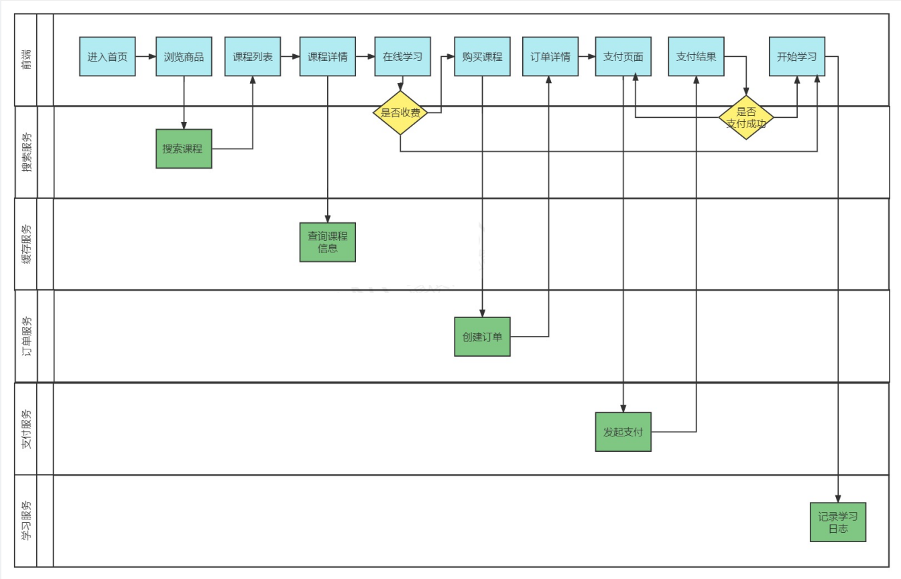

# 学成在线 第一章 讲义-项目开发环境搭建


# 1.项目背景

## 1.1在线教育市场环境

以下内容摘自https://report.iresearch.cn/content/2021/01/358854.shtml

在线教育行业是一个有着极强的广度和深度的行业，从校内到校外；从早幼教到职业培训；从教育工具到全信息化平台等等。

2020年的新冠疫情外生冲击，让在线教育再次站在聚光灯下。疫情下教育领域获融资最多，而其中在线教育最受资本青睐。据[艾瑞咨询](http://s.iresearch.cn/search/airuizixun/)统计，2020年教育行业累计融资1164亿元，其中在线教育融资金额1034亿元，占比89%。与此同时，在行业处于困境的情况下，会加速洗牌，资源向好的企业集中。2020年资源向头部集中趋势明显，中小型机构生存更加困难。2020年资本向在线教育行业累计输送的1034亿元中，80%都流向了头部的5家公司。

**To C市场**

据艾瑞咨询统计核算，2020年中国在线教育行业市场规模2573亿元，过去4年的CAGR达34.5%，其中低幼及素质教育赛道、K12学科培训赛道在线化进程加快是在线教育市场快速增长的最主要贡献因素。疫情影响下，低幼及素质教育领域的在线化范围持续纵深，职业教育领域的在线化进程也在不断加速，新的供给和需求不断产生。但同时，2020年疫情外生冲击加快了2020年的在线教育进程，将会透支一部分2021年的增速，艾瑞预计2021年在线教育行业同比增速将回落到20%左右。


**To B** **市场**

疫情也加速了整个教育产业链的进化，to B机构快速成长起来，扮演着赋能者的角色，课程内容、招生、师训、直播系统、管理系统等产品及服务大量涌现。随着云服务发展成熟以及疫情对直播课需求的催化，大量提供直播授课系统等PaaS/SaaS服务的机构迅速成长起来，成为各种会展上的主力军。


## 1.2 IT培训市场规模

中国IT人才供给报告（https://new.qq.com/rain/a/20210831A01JI600）

IT人才总体供不应求，高中低人才分别占比8%、41%、51%，详见下图：


IT服务是贯穿IT应用系统全生命周期的各项服务的统称，下图是IT服务产品图谱，本项目属于IT培训产业。


下图是IT培训市场规模：


## 1.3 项目背景

本项目是本公司自研的一个专门针对成人职业技能教育的网络课堂系统，网站提供了成人职业技能培训的相关课程，如：软件开发培训、职业资格证书培训、成人学历教育培训等课程。项目基于B2B2C的业务模式，培训机构可以在平台入驻、发布课程，运营人员对发布的课程进行审核，审核通过后课程才可以发布成功，课程包括免费和收费两种形式，对于免费课程可以直接选课学习，对于收费课程在选课后需要支付成功才可以继续学习。

什么是B2B2C？

B2B2C是一种电子商务类型的网络购物商业模式，B是Business的简称，C是Consumer的简称，第一个B指的是商品或服务的供应商，第二个B指的是从事电子商务的企业，C则是表示消费者。

B2B的定义：企业跟企业之间的电子商务运作方式。
B2C的定义：企业跟消费者之间的电子商务运作方式。


# 2 项目介绍

## 2.1 项目介绍 

本项目包括了用户端、机构端、运营端。

核心模块包括：内容管理、媒资管理、课程搜索、订单支付、选课管理、认证授权等。

下图是项目的功能模块图：


本项目采用前后端分离架构，后端采用SpringBoot、SpringCloud技术栈开发，数据库使用了MySQL，还使用的Redis、消息队列、分布式文件系统、Elasticsearch等中间件系统。

划分的微服务包括：内容管理服务、媒资管理服务、搜索服务、订单支付服务、 学习中心服务、系统管理服务、认证授权服务、网关服务、注册中心服务、配置中心服务等。

下边介绍业务流程：

1、课程编辑与发布流程如下：


2、课程发布后学生登录平台进行选课、在线学习。

免费课程可直接学习，收费课程需要下单购买。

学生选课流程如下：




## 2.2 功能模块与演示

本项目包括了用户端、机构端、运营端，核心模块包括：内容管理、媒资管理、课程搜索、订单支付、选课管理、认证授权等。


本项目主要包括三类用户角色：学生、教学机构的老师、平台运营人员。

主要讲解下边的业务流程：

1、教学机构的老师登录教学管理平台，编辑课程信息，发布自己的课程。

2、平台运营人员登录运营平台审核课程、视频等信息，审核通过后课程方可发布。

课程编辑与发布流程如下：


3、课程发布后学生登录平台进行选课、在线学习。

免费课程可直接学习，收费课程需要下单购买。

学生选课流程如下：


下边打开网站进行演示。


## 2.3 面试

1、详细说说你的项目吧

从以下几个方面进行项目介绍：

1、项目的背景，包括：是自研还是外包、什么业务、服务的客户群是谁、谁去运营等问题。

2、项目的业务流程

3、项目的功能模块

4、项目的技术架构

5、个人工作职责

6、个人负责模块的详细说明，包括模块的设计，所用到的技术，技术的实现方案等。

一个例子：

我最近参与的项目是我们公司自研的专门针对成人职业技能教育的网络课堂系统，网站提供了成人职业技能培训的相关课程，如：软件开发培训、职业资格证书培训、成人学历教育培训等课程。项目基于B2B2C的业务模式，培训机构可以在平台入驻、发布课程，我们公司作为运营方由专门的人员对发布的课程进行审核，审核通过后课程才可以发布成功，课程包括免费和收费两种形式，对于免费课程普通用户可以直接选课学习，对于收费课程在选课后需要支付成功才可以继续学习。

本项目包括三个端：用户端(学生端)、机构端、运营端。

核心模块包括：内容管理、媒资管理、课程搜索、订单支付、选课管理、认证授权等。

本项目采用前后端分离架构，后端采用SpringBoot、SpringCloud技术栈开发，数据库使用了MySQL，还使用的Redis、消息队列、分布式文件系统、Elasticsearch等中间件系统。

划分的微服务包括：内容管理服务、媒资管理服务、搜索服务、订单支付服务、 学习中心服务、系统管理服务、认证授权服务、网关服务、注册中心服务、配置中心服务等。

我在这个项目中负责了内容管理、媒资管理、订单支付模块的设计与开发。

内容管理模块，是对平台上的课程进行管理，课程的相关信息比较多这里在数据库设计了课程基本信息表、课程营销表、课程计划、课程师资表进行存储 ，培训机构要发布一门课程需要填写课程基本信息、课程营销信息、课程计划信息、课程师资信息，填写完毕后需要提交审核，由运营人员进行课程信息的审核，整个审核过程是程序自动审核加人工确认的方式，通常24小时审核完成。课程审核通过即可发布课程，课程的相关信息会聚合到课程发布表中，这里不仅要将课程信息写到课程发布表还要将课程信息写到索引库、分布式文件系统中，所以这里存在分布式事务的问题，项目使用本地消息表加任务调度的方式去解决这里的分布式事务，保存数据的最终一致性。


# 3.项目的技术架构（面试）

## 3.1 项目技术架构

​	学成在线项目采用当前流行的前后端分离架构开发，由以下流程来构成：用户层、CDN内容分发和加速、负载均衡、UI层、微服务层、数据层。

> 项目技术架构图


> 技术架构列表
>
> 

| **序号** | **名称**     | **功能描述**                                                 |
| -------- | ------------ | ------------------------------------------------------------ |
| 1        | 用户层       | 用户层描述了本系统所支持的用户类型包括：pc用户、app用户、h5用户。pc用户通过浏览器访问系统、app用户通过android、ios手机访问系统，H5用户通过h5页面访问系统。 |
| 2        | CDN          | CDN全称Content Delivery Network，即内容分发网络，本系统所有静态资源全部通过CDN加速来提高访问速度。系统静态资源包括：html页面、js文件、css文件、image图片、pdf和ppt及doc教学文档、video视频等。 |
| 3        | 负载均衡     | 系统的CDN层、UI层、服务层及数据层均设置了负载均衡服务，上图仅在UI层前边标注了负载均衡。  每一层的负载均衡会根据系统的需求来确定负载均衡器的类型，系统支持4层负载均衡+7层负载均衡结合的方式，4层负载均衡是指在网络传输层进行流程转发，根据IP和端口进行转发，7层负载均衡完成HTTP协议负载均衡及反向代理的功能，根据url进行请求转发。 |
| 4        | UI层         | UI层描述了系统向pc用户、app用户、h5用户提供的产品界面。根据系统功能模块特点确定了UI层包括如下产品界面类型：  1）面向pc用户的门户系统、学习中心系统、教学管理系统、系统管理中心。  2）面向h5用户的门户系统、学习中心系统。  3）面向app用户的门户系统、学习中心系统。 |
| 5        | 微服务层     | 微服务层将系统服务分类三类：业务服务、基础服务、第三方代理服务。  **业务服务**：主要为学成在线核心业务提供服务，并与数据层进行交互获得数据。  **基础服务**：主要管理学成在线系统运行所需的配置、日志、任务调度、短信等系统级别的服务。  **第三方代理服务**：系统接入第三方服务完成业务的对接，例如认证、支付、视频点播/直播、用户认证和授权。 |
| 6        | 数据层             | 数据层描述了系统的数据存储的内容类型，**关系性数据库：**持久化的业务数据使用MySQL。  **消息队列**：存储系统服务间通信的消息，本身提供消息存取服务，与微服务层的系统服务连接。  **索引库：**存储课程信息的索引信息，本身提供索引维护及搜索的服务，与微服务层的系统服务连接。  **缓存：**作为系统的缓存服务，作为微服务的缓存数据便于查询。  **文件存储：**提供系统静态资源文件的分布式存储服务，文件存储服务器作为CDN服务器的数据来源，CDN上的静态资源将最终在文件存储服务器上保存多份。 |

> 流程说明 


1. 用户可以通过pc、手机等客户端访问系统进行在线学习。
2. 系统应用CDN技术，对一些图片、CSS、视频等资源从CDN调度访问。
3. 所有的请求全部经过负载均衡器。
4. 对于PC、H5等客户端请求，首先请求UI层，渲染用户界面。
5. 客户端UI请求服务层获取进行具体的业务操作。
6. 服务层将数据持久化到数据库。


## 3.3 项目技术栈

​	学成在线按照技术分层的基础上，需要对主要层次使用具体的技术作说明。下面是学成在线技术栈结构图。

> 技术栈（技术结构图）


# 4.项目开发环境搭建

## 4.1 开发工具配置

​	在项目开发前期，需要将本地开发环境进行统一配置，方便后期开发中出现因环境问题引起的异常。在真实开发中也是一样的，开发前，需要对开发环境进行统一配置。不同的公司会有不同的开发环境配置，这里需要大家引以重视，到公司开发前一定要先将本地开发环境进行统一。	

参考下发资料中的 “资料/开发工具配置/开发工具配置.md” 文档。


## 4.2 项目工程搭建

### 4.2.1 工程结构关系

​	学成在线使用 Maven 来进行项目的管理和构建。整个项目分为三大类工程：父工程、基础工程 和微服务工程。


​	每一种类的工程都有不同的作用，下面是对其功能进行说明：

- 父工程
  - 对依赖包的版本进行管理 
  - 本身为Pom工程，对子工程进行聚合管理 
  
- 基础工程
  - 继承父类工程

  - 提供基础类库

  - 提供工具类库

    

- 微服务工程
  
  - 分别从业务、技术方面划分模块，每个模块构建为一个微服务。
  - 每个微服务工程依赖基础工程，间接继承父工程。
  - 包括：内容管理服务、媒资管理服务、搜索服务、缓存服务、消息服务等。


### 4.2.2 构建父工程 

父程的职责是对依赖包的版本进行管理，本小节创建父工程分两步，第一创建父工程，第二在pom.xml编辑依赖管理。

1、首先创建父工程

为了对代码更好的进行权限管理，这里我们单独创建父工程。

使用idea打开工程目录，进入工程结构界面。

点击File-->Project Structure: 


进入Project Structure,首先检查jdk是否配置正确，并进行配置。


进入Modules界面，新建模块


进入新建模块界面，选择Spring Initializr，填写模块的信息。

注意：这里Server URL默认是start.spring.io，如果连接不上可换为start.aliyun.com。


填写模块信息注意坐标信息填写正确，填写完毕，点击Next

进入下一步不用选择任何依赖，点击“Create”。

模块创建成功，


发现通过idea创建的工程有很多多余文件，这时需要把里边多余的文件和目录删除。


点击“Delete” 删除成功，如下图：


到此父工程创建完成。

2、依赖管理定义

下边开始编辑xuecheng-plus-parent父工程的依赖管理 。

父工程中没有代码，不用去依赖其它的包，它的作用是限定其它子工程依赖包的版本号，即在dependencyManagement 中去编辑即可。

1）确定父工程为一个pom工程，在pom.xml中添加如下内容：

```
<packaging>pom</packaging>
```

2）确定项目所以依赖的包及其版本号。

```
<properties>
        <java.version>1.8</java.version>
        <project.build.sourceEncoding>UTF-8</project.build.sourceEncoding>
        <project.reporting.outputEncoding>UTF-8</project.reporting.outputEncoding>
        <spring-boot.version>2.3.7.RELEASE</spring-boot.version>
        <spring-cloud.version>Hoxton.SR9</spring-cloud.version>
        <org.mapstruct.version>1.3.1.Final</org.mapstruct.version>
        <spring-cloud-alibaba.version>2.2.6.RELEASE</spring-cloud-alibaba.version>
        <org.projectlombok.version>1.18.8</org.projectlombok.version>
        <javax.servlet-api.version>4.0.1</javax.servlet-api.version>
        <fastjson.version>1.2.83</fastjson.version>
        <druid-spring-boot-starter.version>1.2.8</druid-spring-boot-starter.version>
        <mysql-connector-java.version>8.0.30</mysql-connector-java.version>
        <mybatis-plus-boot-starter.version>3.4.1</mybatis-plus-boot-starter.version>
        <commons-lang.version>2.6</commons-lang.version>
        <minio.version>8.4.3</minio.version>
        <xxl-job-core.version>2.3.1</xxl-job-core.version>
        <swagger-annotations.version>1.5.20</swagger-annotations.version>
        <commons-lang3.version>3.10</commons-lang3.version>
        <okhttp.version>4.8.1</okhttp.version>
        <swagger-spring-boot-starter.version>1.9.0.RELEASE</swagger-spring-boot-starter.version>
        <elasticsearch.version>7.12.1</elasticsearch.version>
    </properties>
```

编写dependencyManagement l来限定所依赖包的版本。

```
    <dependencyManagement>
        <dependencies>

            <dependency>
                <groupId>org.springframework.cloud</groupId>
                <artifactId>spring-cloud-dependencies</artifactId>
                <version>${spring-cloud.version}</version>
                <type>pom</type>
                <scope>import</scope>
            </dependency>
            <dependency>
                <groupId>org.springframework.boot</groupId>
                <artifactId>spring-boot-dependencies</artifactId>
                <version>${spring-boot.version}</version>
                <type>pom</type>
                <scope>import</scope>
            </dependency>
            <dependency>
                <groupId>com.alibaba.cloud</groupId>
                <artifactId>spring-cloud-alibaba-dependencies</artifactId>
                <version>${spring-cloud-alibaba.version}</version>
                <type>pom</type>
                <scope>import</scope>
            </dependency>
            <!-- lombok，简化类的构建-->
            <dependency>
                <groupId>org.projectlombok</groupId>
                <artifactId>lombok</artifactId>
                <version>${org.projectlombok.version}</version>
            </dependency>
            <!-- mapstruct 代码生成器，简化java bean之间的映射 -->
            <dependency>
                <groupId>org.mapstruct</groupId>
                <artifactId>mapstruct-jdk8</artifactId>
                <version>${org.mapstruct.version}</version>
            </dependency>
            <dependency>
                <groupId>org.mapstruct</groupId>
                <artifactId>mapstruct-processor</artifactId>
                <version>${org.mapstruct.version}</version>
            </dependency>
            <dependency>
                <groupId>io.swagger</groupId>
                <artifactId>swagger-annotations</artifactId>
                <version>${swagger-annotations.version}</version>
            </dependency>
            <!-- Servlet 容器管理 -->
            <dependency>
                <groupId>javax.servlet</groupId>
                <artifactId>javax.servlet-api</artifactId>
                <version>${javax.servlet-api.version}</version>
                <scope>provided</scope>
            </dependency>
            <!-- fastjson ，json解析工具 -->
            <dependency>
                <groupId>com.alibaba</groupId>
                <artifactId>fastjson</artifactId>
                <version>${fastjson.version}</version>
            </dependency>
            <!-- druid 连接池管理 -->
            <dependency>
                <groupId>com.alibaba</groupId>
                <artifactId>druid-spring-boot-starter</artifactId>
                <version>${druid-spring-boot-starter.version}</version>
            </dependency>

            <!-- mySQL数据库驱动包管理 -->
            <dependency>
                <groupId>mysql</groupId>
                <artifactId>mysql-connector-java</artifactId>
                <version>${mysql-connector-java.version}</version>
            </dependency>
            <!-- mybatis plus 集成Spring Boot启动器 -->
            <dependency>
                <groupId>com.baomidou</groupId>
                <artifactId>mybatis-plus-boot-starter</artifactId>
                <version>${mybatis-plus-boot-starter.version}</version>
            </dependency>

            <!-- mybatis plus 代码生成器 -->
            <dependency>
                <groupId>com.baomidou</groupId>
                <artifactId>mybatis-plus-generator</artifactId>
                <version>${mybatis-plus-boot-starter.version}</version>
            </dependency>

            <!-- 工具类管理 -->
            <dependency>
                <groupId>commons-lang</groupId>
                <artifactId>commons-lang</artifactId>
                <version>${commons-lang.version}</version>
            </dependency>
            <!-- 分布式文件系统 minIO的客户端API包 -->
            <dependency>
                <groupId>io.minio</groupId>
                <artifactId>minio</artifactId>
                <version>${minio.version}</version>
            </dependency>
            <!--google推荐的一套工具类库-->
            <dependency>
                <groupId>com.google.guava</groupId>
                <artifactId>guava</artifactId>
                <version>25.0-jre</version>
            </dependency>
            <!--分布式任务调度-->
            <dependency>
                <groupId>com.xuxueli</groupId>
                <artifactId>xxl-job-core</artifactId>
                <version>${xxl-job-core.version}</version>
            </dependency>
            <!--Spring boot单元测试-->
            <dependency>
                <groupId>org.springframework.boot</groupId>
                <artifactId>spring-boot-starter-test</artifactId>
                <version>${spring-boot.version}</version>
                <scope>test</scope>
                <exclusions>
                    <exclusion>
                        <groupId>org.junit.vintage</groupId>
                        <artifactId>junit-vintage-engine</artifactId>
                    </exclusion>
                </exclusions>
            </dependency>
            <dependency>
                <groupId>com.squareup.okhttp3</groupId>
                <artifactId>okhttp</artifactId>
                <version>${okhttp.version}</version>
            </dependency>
            <dependency>
                <groupId>org.apache.commons</groupId>
                <artifactId>commons-lang3</artifactId>
                <version>${commons-lang3.version}</version>
            </dependency>
            <dependency>
                <groupId>com.spring4all</groupId>
                <artifactId>swagger-spring-boot-starter</artifactId>
                <version>${swagger-spring-boot-starter.version}</version>
            </dependency>
            <dependency>
                <groupId>org.elasticsearch.client</groupId>
                <artifactId>elasticsearch-rest-high-level-client</artifactId>
                <version>${elasticsearch.version}</version>
            </dependency>

            <dependency>
                <groupId>org.elasticsearch</groupId>
                <artifactId>elasticsearch</artifactId>
                <version>${elasticsearch.version}</version>
            </dependency>
        </dependencies>

    </dependencyManagement>
```

编辑打包插件：

```
    <build>
        <finalName>${project.name}</finalName>
        <!--编译打包过虑配置-->
        <resources>
            <resource>
                <directory>src/main/resources</directory>
                <filtering>true</filtering>
                <includes>
                    <include>**/*</include>
                </includes>
            </resource>
            <resource>
                <directory>src/main/java</directory>
                <includes>
                    <include>**/*.xml</include>
                </includes>
            </resource>
        </resources>
        <plugins>
            <!--打包插件-->
            <plugin>
                <groupId>org.springframework.boot</groupId>
                <artifactId>spring-boot-maven-plugin</artifactId>
                <version>${spring-boot.version}</version>
            </plugin>

            <plugin>
                <groupId>org.apache.maven.plugins</groupId>
                <artifactId>maven-compiler-plugin</artifactId>
                <version>3.8.1</version>
                <configuration>
                    <!--指定项目源码jdk的版本-->
                    <source>1.8</source>
                    <!--指定项目编译后的jdk的版本-->
                    <target>1.8</target>
                    <!--配置注解预编译-->
                    <annotationProcessorPaths>
<!--                        <path>
                            <groupId>org.mapstruct</groupId>
                            <artifactId>mapstruct-processor</artifactId>
                            <version>${org.mapstruct.version}</version>
                        </path>-->
                        <path>
                            <groupId>org.projectlombok</groupId>
                            <artifactId>lombok</artifactId>
                            <version>${org.projectlombok.version}</version>
                        </path>
                    </annotationProcessorPaths>
                </configuration>
            </plugin>

            <!--责处理项目资源文件并拷贝到输出目录，如果有额外的资源文件目录则需要配置-->
            <plugin>
                <groupId>org.apache.maven.plugins</groupId>
                <artifactId>maven-resources-plugin</artifactId>
                <version>3.3.0</version>
                <configuration>
                    <encoding>utf-8</encoding>
                    <!--使用默认分隔符，resource中可以使用分割符定义过虑的路径-->
                    <useDefaultDelimiters>true</useDefaultDelimiters>
                </configuration>
            </plugin>
        </plugins>
    </build>
```

工程创建完成提交至git。


### 4.2.3 构建基础工程

基础工程的职责是提供一些系统架构所需要的基础类库以及一此工具类库。

1、首先创建基础工程xuecheng-plus-base。

创建的过程同父工程的创建过程，如下图：


创建完成，删除多余文件，如下图：


这里需要注意的是xuecheng-plus-base的父工程为xuecheng-plus-parent，xuecheng-plus-base的pom.xml的如下：

```
<?xml version="1.0" encoding="UTF-8"?>
<project xmlns="http://maven.apache.org/POM/4.0.0" xmlns:xsi="http://www.w3.org/2001/XMLSchema-instance"
         xsi:schemaLocation="http://maven.apache.org/POM/4.0.0 https://maven.apache.org/xsd/maven-4.0.0.xsd">
    <modelVersion>4.0.0</modelVersion>
    <parent>
        <artifactId>xuecheng-plus-parent</artifactId>
        <groupId>com.xuecheng</groupId>
        <version>0.0.1-SNAPSHOT</version>
        <relativePath>../xuecheng-plus-parent</relativePath>
    </parent>
    <artifactId>xuecheng-plus-base</artifactId>
    <name>xuecheng-plus-base</name>
    <description>xuecheng-plus-base</description>

  <dependencies>
        <dependency>
            <groupId>org.projectlombok</groupId>
            <artifactId>lombok</artifactId>
        </dependency>
        <dependency>
            <groupId>org.apache.commons</groupId>
            <artifactId>commons-lang3</artifactId>
        </dependency>
        <!-- fast Json -->
        <dependency>
            <groupId>com.alibaba</groupId>
            <artifactId>fastjson</artifactId>
        </dependency>

        <!-- servlet Api 依赖 -->
        <dependency>
            <groupId>javax.servlet</groupId>
            <artifactId>javax.servlet-api</artifactId>
            <scope>provided</scope>
        </dependency>

        <!-- 通用组件 -->
        <dependency>
            <groupId>commons-lang</groupId>
            <artifactId>commons-lang</artifactId>
        </dependency>
        <dependency>
            <groupId>commons-codec</groupId>
            <artifactId>commons-codec</artifactId>
            <version>1.11</version>
        </dependency>
        <dependency>
            <groupId>io.swagger</groupId>
            <artifactId>swagger-annotations</artifactId>
        </dependency>
        <dependency>
            <groupId>org.springframework</groupId>
            <artifactId>spring-web</artifactId>
        </dependency>
        <dependency>
            <groupId>org.springframework.boot</groupId>
            <artifactId>spring-boot-starter-validation</artifactId>
        </dependency>
        <dependency>
            <groupId>org.springframework.boot</groupId>
            <artifactId>spring-boot-starter-log4j2</artifactId>
        </dependency>
        <!--根据扩展名取mimetype-->
        <dependency>
            <groupId>com.j256.simplemagic</groupId>
            <artifactId>simplemagic</artifactId>
            <version>1.17</version>
        </dependency>
        <dependency>
            <groupId>org.apache.commons</groupId>
            <artifactId>commons-lang3</artifactId>
        </dependency>
        <dependency>
            <groupId>com.google.zxing</groupId>
            <artifactId>core</artifactId>
            <version>3.3.3</version>
        </dependency>

        <dependency>
            <groupId>com.google.zxing</groupId>
            <artifactId>javase</artifactId>
            <version>3.3.3</version>
        </dependency>
         <dependency>
                    <groupId>com.fasterxml.jackson.module</groupId>
                    <artifactId>jackson-module-parameter-names</artifactId>
                </dependency>
                <dependency>
                    <groupId>com.fasterxml.jackson.datatype</groupId>
                    <artifactId>jackson-datatype-jdk8</artifactId>
                </dependency>
                <dependency>
                    <groupId>com.fasterxml.jackson.datatype</groupId>
                    <artifactId>jackson-datatype-jsr310</artifactId>
                </dependency>
    </dependencies>
</project>

```

基础工程中的内容待需要时再行开发。

至此父工程和基础工程创建完成，最后提交至git。

### 4.2.4  提交Git

在项目工程的根目录添加.gitignore文件，编辑内容如下：

```
HELP.md
target/
!.mvn/wrapper/maven-wrapper.jar
!**/src/main/**
!**/src/test/**

### STS ###
.apt_generated
.classpath
.factorypath
.project
.settings
.springBeans
.sts4-cache

### IntelliJ IDEA ###
.idea
*.iws
*.iml
*.ipr

### NetBeans ###
/nbproject/private/
/nbbuild/
/dist/
/nbdist/
/.nb-gradle/
build/
logs/

### VS Code ###
.vscode/

```

将基础工程代码提交到git

初次提交git要求输入gogs的账号和密码


使用自己在gogs上开通的账号和密码提交代码。

账号或密码错误时报如下错误


## 4.3 面试

1、Git代码冲突怎么处理？

我们在使用Git时难免会出现代码冲突的问题，出现冲突的原因是因为当本地文件的版本与目标分支中文件的版本不一致时当存在同一行的内容不同时在进行合并时会出现冲突。

代码冲突一般发生在以下情况：

1、多个分支向主分支合并时

2、同一个分支下pull或push操作时。

发生了冲突需要手动合并代码，选择最终的版本，可以通过图形界面，如下：


点击Merge


选择版本后，点击Apply，提交代码并push到远程仓库。

不通过图形化界面处理冲突，当出现冲突后在代码中自动添加了版本标识，如下：


手动修改代码如下：


将文件添加到暂存区，提交文件，push到远程仓库即可。

2、你是在哪个分支开发？


我们不是直接在主分支开发，由技术经理创建独立的开发分支，我们是在独立的开发分支中进行开发，最后由技术经理将开发分支合并到主分支。


3、maven依赖版本冲突怎么处理？

maven依赖版本冲突一般是由于间接依赖导致一个jar包即有多个不同的版本，比如：A依赖了B的1.0版本，C依赖了B的2.0版本，项目依赖A和C从而间接依赖了B的1.0和2.0版本，此时B有两个版本引入到了项目中，当存在版本冲突时可能会出现ClassNotFoundException、NoSuchMethodError等错误。

处理版本冲突可以使用以下方法：

1、使用exclusions 排除依赖

比如：我们只依赖B的1.0版本，此时可以在依赖C时排除对B的依赖。

2、使用dependencyManagement锁定版本号。

通常在父工程对依赖的版本统一管理。

比如：我们只依赖B的1.0版本，此时可以在父工程中限定B的版本为1.0。


4、maven的常用命令

mvn clean //清除target目录中的生成结果

mvn compile //编译源代码

mvn test //执行单元测试

mvn package  //打包

mvn install //打包并把打好的包保存到本地仓库

mvn deploy //打包并把打好的包上传到远程仓库


## 4.3 项目数据库环境

### 4.3.1 PowerDesigner

#### 4.3.1.1 安装PowerDesigner

PowderDesigner是一个软件建模工具，使用它进行系统的分析与设计，虽然它出生很早但使用者仍然很多，PowderDesigner的功能很强大，它可以做概念模型、物理模型、面向对象模型、以及绘制数据 流程图、UML类图等，本项目使用PowderDesigner完成数据库物理模型的创建。

首先安装PowerDesigner16.x版本。（PowerDesigner165.exe）

下载 32位的 MySQL Connector/ODBC 8.0.29  (mysql-connector-odbc-8.0.29-win32.msi)

课程资料中提供了PowerDesigner165、mysql-connector-odbc-8.0.29-win32.msi

也可以手工下载，下载地址如下：

https://downloads.mysql.com/archives/c-odbc/

https://downloads.mysql.com/archives/get/p/10/file/mysql-connector-odbc-8.0.29-win32.msi


#### 4.3.1.2 创建物理模型

概念模型是根据用户提出的原始需求梳理实体类型及实体属性，物理模型则对应了数据库的表结构，使用PowderDesigner可以将概念模型转为物理模型，也可以直接将物理模型直接生成sql脚本或直接在数据库中执行。

如何物理一个物理模型？

1、创建物理模型

新建一个Model，如下图：


选择物理模型：


点击OK


点击保存，保存物理模型


点击保存全部，保存工作区


#### 4.3.1.3 创建表

点击模型名称，选择表，进行创建。


双击开始设计表的结构 ，打开Table properties，填写表名等信息，如下 图


填写完成点击Columns，如下图：


填写完成点击确定，创建表成功。


再次双击表，打开Table Properties，选择用户。


输入用户名称，这里要和数据库名一致。


创建成功，如下图：


#### 4.3.1.4 配置连接 

表结构创建完成下边开始生成SQL，准备在数据库中创建表。

首先配置连接信息。


添加数据 源


如果出现下边的提示需要以管理 员方式打开PowerDesigner


以管理员方式打开PowderDesigner，打开数据模型

如果出现下边的提示则需要选择数据模型文件 所在的目录，如下图：


选择数据模型所在目录：


点击“OK”

再次配置连接信息。


添加数据 源


打开添加数据 源窗口


选择系统数据源，点击“下一步”


选择“MySQL ODBC 8.0 ANSI Driver”，点击下一步


点击完成

填写连接信息


填写完成，点击“OK”


#### 4.3.1.5 生成SQL

配置连接 信息完成，下一步开始生成SQL，进入Database--Generate Database:


打开生成SQL的窗口


在Options窗口取消创建用户的选项


选择字符编码


确定用户：


预览sql


点击确定，开始生成sql


生成完成，查看sql的内容


下边准备在数据 库执行sql，使用客户端连接数据库，创建xc_content数据库


复制sql开始执行。


执行成功，查看数据库中表已生成。


#### 4.3.1.6 修改表结构 

如果要修改表结构也是先在PowerDesigner中修改，然后确定无误将修改的内容应用到数据库。

修改前需要将之前的数据模型保存一份，作用旧版本。

进入数据模型，另存为新的数据模型


新的数据模型文件建议加上版本号：


点击保存。

此时工作区中为新的数据模型。


现在即可在新的数据模型中修改表结构

比如现在在表中添加一个字段age。


点击“确定”添加成功


修改完表结构可以使用PowerDesigner应用到数据 库中

点击 Database-->Apply Model Changes to Database:


打开窗口


选择目标数据源


修改数据源


这里要填写数据库名

点击”OK“

选择源数据模型


点击”打开“


覆盖sql文件。


点击”OK“

预览sql


点击”Run“执行

查看数据库，新表创建成功


新表为我们修改后的最新表结构，原表的数据自动导入新表。

#### 4.3.1.7 逆向工程 

在企业开发中难免要去维护老系统，而老系统并没有这些设计好的数据模型，此时就需要用到powerDesigner的逆向工程，根据数据库中的表来生成数据模型。

进入Database-->Update Model from Database


选择数据源


下一步选择要生成数据模型的表


确认选择的表正确，


点击”OK“开始生成数据模型。

生成成功，如下图：


双击打开Table Properties，查看并编辑


### 4.3.2 导入数据库

将课程资料目录下的db.zip解压，使用navicat工具导入这些数据库脚本。

一般情况每个微服务有自己独立的数据库，下边创建内容管理微服务使用的数据库、系统管理微服务使用的数据库

说明：每个班级创建不同的数据库，比如148期创建xc148_content为内容管理数据库、xc148_system系统管理数据库

下边示例创建了以1010班级命名的内容管理数据库：xc1010_content，系统管理数据库参考此方法创建。


下边导入sql脚本，右键数据库名，选择运行SQL文件


选择SQL文件，运行：


刷新数据库查看是否成功创建表


###  4.3.3 面试

1、MySQL常见的存储引擎及区别？

一、InnoDB

1、支持事务。

2、使用的锁粒度默认为行级锁，可以支持更高的并发；也支持表锁。

3、支持外键约束；外键约束其实降低了表的查询速度，增加了表之间的耦合度。

二、MyISAM

1、不提供事务支持

2、只支持表级锁

3、不支持外键

三、memory

数据存储在内存中

总结:

• MyISAM管理非事务表，提供高速存储和检索以及全文搜索能力，如果在应用中执行大量select操作，应该选择MyISAM

• InnoDB用于事务处理，具有ACID事务支持等特性，如果在应用中执行大量insert和update操作，应该选择InnoDB


2、MySQL建表时注意什么？

MySQL建表的经验有很多，下边列举一些： 

1、注意选择存储引擎，如果要支持事务需要选择InnoDB。

2、注意字段类型的选择，对于日期类型如果要记录时分秒建议使用datetime，只记录年月日使用date类型，对于字符类型的选择，固定长度字段选择char，不固定长度的字段选择varchar，varchar比char节省空间但速度没有char快；对于内容介绍类的长广文本字段使用text或longtext类型;如果存储图片等二进制数据使用blob或longblob类型；对金额字段建议使用DECIMAL；对于数值类型的字段在确保取值范围足够的前提下尽量使用占用空间较小的类型，

3、主键字段建议使用自然主键，不要有业务意义，建议使用int unsigned类型，特殊场景使用bigint类型。

4、如果要存储text、blob字段建议单独建一张表，使用外键关联。

5、尽量不要定义外键，保证表的独立性，可以存在外键意义的字段。

6、设置字段默认值，比如：状态、创建时间等。

7、每个字段写清楚注释。

8、注意字段的约束，比如：非空、唯一、主键等。