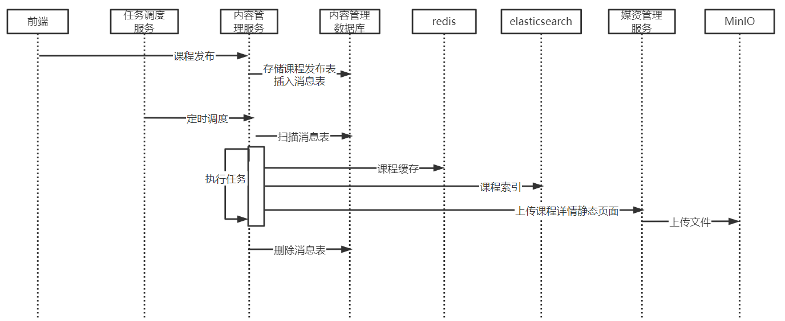
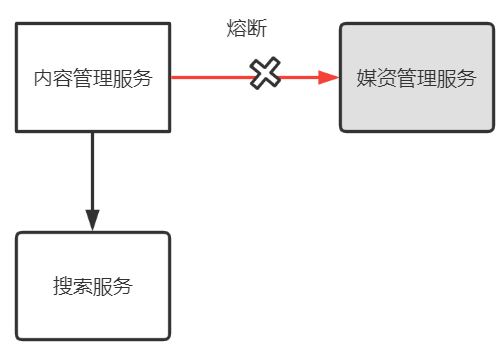

# **第4章 课程发布**

## **1 模块需求分析**

### **1.1 模块介绍**

课程信息编辑完毕即可发布课程，发布课程相当于一个确认操作，课程发布后学习者通过学成在线平台的网站可以搜索到课程，然后查看课程的详细信息，选课、学习。

下边是课程编辑与发布的整体流程：


为了课程内容没有违规信息、课程内容安排合理，在课程发布之间平台运营方会进行课程审核，审核通过后课程方可发布。

作为课程制作方即教学机构，在课程发布前通过课程预览功能可以看到课程发布后的效果，哪里的课程信息存在问题方便查看，及时修改。

下图是课程预览的效果图，也是课程正式发布后的课程详情界面：


教学机构确认课程内容无误，提交审核，平台运营人员对课程内容审核，审核通过后教学机构人员发布课程成功。

课程发布模块共包括三块功能：

1、课程预览

2、课程审核

3、课程发布

### **1.2 业务流程**

#### **1.2.1 课程预览**

1.**教育机构用户**在`课程管理`中可对该机构内所管理的课程进行检索。


2.点击某课程数据后的`预览`链接，即可对该课程进行预览，可以看到发布后的详情页面效果。

下图是课程详情首页，显示了课程的基本。


点击课程目录，显示课程计划，通过此界面去核实课程计划的信息是否存在问题。


点击课程目录中的具体章节，查看视频播放是否正常


#### **1.2.2 课程审核**

教学机构提交课程审核后，平台运营人员登录运营平台查询待审核的记录。


具体审核的过程与课程预览的过程类似，运营人员查看课程信息、课程视频等内容。

如果存在问题则审核不通过，并附上审核不通过的原因供教学机构人员查看。

如果课程内容没有违规信息且课程内容全面则审核通过。

课程审核通过后教学机构发布课程成功。

#### **1.2.3 课程发布**

1.**教育机构用户**在`课程管理`中可对机构内课程进行检索。


2.点击某课程数据后的 `发布` 链接（审核状态为通过），即可对该课程进行发布。


3、课程发布后可通过课程搜索查询到课程信息，并查看课程的详细信息。


4 点击`课程搜索页`中课程列表的某个课程，可进入`课程详情页`。


## **2 课程预览**

### **2.1 需求分析**

课程预览就是把课程的相关信息进行整合，在课程详情界面进行展示，通过课程预览页面查看信息是否存在问题。


下图是课程预览的数据来源：


在课程预览页面点击"视频播放图片"打开视频播放页面，通过视频播放页面查看课程计划对应的视频是否存在问题。


课程预览的效果与最终课程发布后查看到的效果是一致的，所以课程预览时会通过网站门户域名地址进行预览，下图显示了整个课程预览的流程图：


说明如下：

1、点击课程预览，通过Nginx、后台服务网关请求内容管理服务进行课程预览。

2、内容管理服务查询课程相关信息进行整合，并通过模板引擎技术在服务端渲染生成页面，返回给浏览器。

3、通过课程预览页面点击”马上学习“打开视频播放页面。

4、视频播放页面通过Nginx请求后台服务网关，查询课程信息展示课程计划目录，请求媒资管理查询课程计划绑定的视频文件地址，在浏览播放视频。


### **2.2 模板引擎**

#### **2.2.1 什么是模板引擎**

根据前边的数据模型分析，课程预览就是把课程的相关信息进行整合，在课程预览界面进行展示，课程预览界面与课程发布的课程详情界面一致，保证了教学机构人员发布前看到什么样，发布后也会看到什么样。

项目采用模板引擎技术实现课程预览界面。<font style="background: pink">**什么是模板引擎？**</font>

早期我们采用的jsp技术就是一种模板引擎技术，如下图：


1、浏览器请求web服务器

2、服务器渲染页面，渲染的过程就是向jsp页面(模板)内填充数据(模型)。

3、服务器将渲染生成的页面返回给浏览器。

所以模板引擎就是：模板+数据=输出，Jsp页面就是模板，页面中嵌入的jsp标签就是数据，两者相结合输出html网页。

常用的java模板引擎还有哪些？

Jsp、Freemarker、Thymeleaf 、Velocity 等。

本项目采用Freemarker作为模板引擎技术。

Freemarker官方地址：http://freemarker.foofun.cn/

FreeMarker 是一款 *模板引擎*： 即一种基于模板和要改变的数据， 并用来生成输出文本(HTML网页，电子邮件，配置文件，源代码等)的通用工具。 它不是面向最终用户的，而是一个Java类库，是一款程序员可以嵌入他们所开发产品的组件。FreeMarker 是 [免费的](http://www.fsf.org/philosophy/free-sw.html)， 基于Apache许可证2.0版本发布。

#### **2.2.2 Freemarker快速入门**

下边在内容管理接口层搭建Freemarker的运行环境并进行测试。

在内容管理接口工层 添加Freemarker与SpringBoot的整合包

```XML
<!-- Spring Boot 对结果视图 Freemarker 集成 -->
<dependency>
    <groupId>org.springframework.boot</groupId>
    <artifactId>spring-boot-starter-freemarker</artifactId>
</dependency>
```
在nacos为内容管理接口层配置freemarker，新加一个freemarker-config-dev.yaml


配置信息如下：

```YAML
spring:
  freemarker:
    enabled: true
    cache: false   #关闭模板缓存，方便测试
    settings:
      template_update_delay: 0
    suffix: .ftl   #页面模板后缀名
    charset: UTF-8
    template-loader-path: classpath:/templates/   #页面模板位置(默认为 classpath:/templates/)
    resources:
      add-mappings: false   #关闭项目中的静态资源映射(static、resources文件夹下的资源)
    
```

在内容管理接口工程添加freemarker-config-dev.yaml


添加模板，在resources下创建templates目录，添加test.ftl模板文件

```HTML
<!DOCTYPE html>
<html>
<head>
    <meta charset="utf-8">
    <title>Hello World!</title>
</head>
<body>
Hello ${name}!
</body>
</html>
```
编写controller方法，准备模型数据

```Java
package com.xuecheng.content.api;

import org.bouncycastle.math.raw.Mod;
import org.springframework.stereotype.Controller;
import org.springframework.web.bind.annotation.GetMapping;
import org.springframework.web.servlet.ModelAndView;

import java.util.Map;

/**
 * @author Mr.M
 * @version 1.0
 * @description freemarker测试
 * @date 2022/9/15 19:20
 */
@Controller
public class FreemarkerController {

    @GetMapping("/testfreemarker")
    public ModelAndView test(){
        ModelAndView modelAndView = new ModelAndView();
        //设置模型数据
        modelAndView.addObject("name","小明");
        //设置模板名称
        modelAndView.setViewName("test");
        return modelAndView;
    }


}
```
启动内容管理接口工程，访问http://localhost:63040/content/testfreemarker

屏幕输出：Hello 小明！


freemarker提供很多指令用于解析各种类型的数据模型，参考地址：http://freemarker.foofun.cn/ref_directives.html

### **2.3 测试静态页面**

#### **2.3.1 部署网站门户**

在课程预览界面上要加载css、js、图片等内容，这里部署nginx来访问这些静态资源，对于SpringBoot服务的动态资源由Nginx去代理请求，如下图：


1、在本机安装 Nginx ，从课程资料目录获取nginx-1.23.1.zip并解压。

2、运行nginx-1.23.1目录下的nginx.exe。

默认端口为80，如果本机80端口被占用，则需要杀掉占用进程后再启动nginx。

如果无法杀掉80端口占用进程则需要修改nginx-1.23.1目录下conf/nginx.conf配置文件


将80端口修改为空闲端口。

启动nginx，访问http://localhost 出现下边的网页表示启动成功


下边开始部署前端工程：

1、从课程资料目录获取xc-ui-pc-static-portal.zip 并解压。

2、修改本机hosts文件，加入127.0.0.1 www.xuecheng-plus.com。

window10操作系统hosts文件在C:\Windows\System32\drivers\etc下

Centos7操作系统的hosts文件在/etc目录下。

在hosts文件加入如下配置

```Plain Text
127.0.0.1 www.xuecheng-plus.com file.xuecheng-plus.com ucenter.xuecheng-plus.com teacher.xuecheng-plus.com
```
3、在nginx-1.23.1目录中找到conf目录，配置目录下的nginx.conf文件。

配置内容如下：

```Plain Text
server {
        listen       80;
        server_name  www.xuecheng-plus.com localhost;
        #rewrite ^(.*) https://$server_name$1 permanent;
        #charset koi8-r;
        ssi on;
        ssi_silent_errors on;
        #access_log  logs/host.access.log  main;

        location / {
            alias   D:/itcast2022/xc_edu3.0/code_1/xc-ui-pc-static-portal/;
            index  index.html index.htm;
        }
        #静态资源
        location /static/img/ {  
                alias  D:/itcast2022/xc_edu3.0/code_1/xc-ui-pc-static-portal/img/;
        } 
        location /static/css/ {  
                alias   D:/itcast2022/xc_edu3.0/code_1/xc-ui-pc-static-portal/css/;
        } 
        location /static/js/ {  
                alias   D:/itcast2022/xc_edu3.0/code_1/xc-ui-pc-static-portal/js/;
        } 
        location /static/plugins/ {  
                alias   D:/itcast2022/xc_edu3.0/code_1/xc-ui-pc-static-portal/plugins/;
                add_header Access-Control-Allow-Origin http://ucenter.xuecheng-plus.com;  
                add_header Access-Control-Allow-Credentials true;  
                add_header Access-Control-Allow-Methods GET;
        } 
        location /plugins/ {  
                alias   D:/itcast2022/xc_edu3.0/code_1/xc-ui-pc-static-portal/plugins/;
        } 


        #error_page  404              /404.html;

        # redirect server error pages to the static page /50x.html
        #
        error_page   500 502 503 504  /50x.html;
        location = /50x.html {
            root   html;
        }

        # proxy the PHP scripts to Apache listening on 127.0.0.1:80
        #
        #location ~ \.php$ {
        #    proxy_pass   http://127.0.0.1;
        #}

        # pass the PHP scripts to FastCGI server listening on 127.0.0.1:9000
        #
        #location ~ \.php$ {
        #    root           html;
        #    fastcgi_pass   127.0.0.1:9000;
        #    fastcgi_index  index.php;
        #    fastcgi_param  SCRIPT_FILENAME  /scripts$fastcgi_script_name;
        #    include        fastcgi_params;
        #}

        # deny access to .htaccess files, if Apache's document root
        # concurs with nginx's one
        #
        #location ~ /\.ht {
        #    deny  all;
        #}
    }
```

启动nginx:

进入任务管理器，杀死nginx的两个进程


杀死后再次双击nginx.exe。

启动成功在任务管理器会出现nginx的进程。

日志文件在nginx安装目录下的logs目录：


启动成功访问http://www.xuecheng-plus.com  


#### **2.3.2 课程详情页面**

course_template.html是一个静态html页面，里边还没有添加freemarker标签，如果要预览该页面需要借助Nginx进行预览，因为页面需要加载一些css样式表、图片等内容。

course_template.html文件在xc-ui-pc-static-portal\course目录下


通过浏览器访问：http://www.xuecheng-plus.com/course/course_template.html 

效果如下：


出现这个画面说明模板文件正常浏览是没有问题的。

#### **2.3.3 文件服务器**

在进行课程预览时需要展示课程的图片，在线插放课程视频，课程图片、视频这些都在MinIO文件系统存储，下边统一由Nginx代理，通过文件服务域名统一访问。如下图：


在hosts文件配置如下内容，如果已存在不要重复配置。

```Java
127.0.0.1 www.xuecheng-plus.com file.xuecheng-plus.com
```
在nginx.conf中配置文件服务器的代理地址

```Java
   #文件服务
  upstream fileserver{
    server 192.168.101.65:9000 weight=10;
  } 
   server {
        listen       80;
        server_name  file.xuecheng-plus.com;
        #charset koi8-r;
        ssi on;
        ssi_silent_errors on;
        #access_log  logs/host.access.log  main;
        location /video {
            proxy_pass   http://fileserver;
        }

        location /mediafiles {
            proxy_pass   http://fileserver;
        }
   }
```
配置完毕，重新加载nginx配置文件。

通过cmd进入nginx.exe所在目录,运行如下命令

```Plain Text
nginx.exe -s reload
```
通过http://file.xuecheng-plus.com/video/视频文件地址  访问视频

通过http://file.xuecheng-plus.com/mediafiles/图片文件地址  访问图片

在媒资数据库的文件表中找一个视频、图片的地址进行测试。

#### **2.3.4 视频播放页面**

进入课程详情页面，点击马上学习或课程目录下的小节的名称将打开视频播放页面。


首先在nginx.conf中配置视频播放页面的地址

```Java
        location /course/preview/learning.html {
                alias D:/itcast2022/xc_edu3.0/code_1/xc-ui-pc-static-portal/course/learning.html;
        } 
        location /course/search.html {  
                root   D:/itcast2022/xc_edu3.0/code_1/xc-ui-pc-static-portal;
        } 
        location /course/learning.html {  
                root   D:/itcast2022/xc_edu3.0/code_1/xc-ui-pc-static-portal;
        } 
```
加载nginx配置文件

点击课程详情页面上的视频播放链接，打开视频播放页面，如下图：


下边需要配置视频播放路径来测试视频播放页面，找到页面中videoObject对象的定义处，配置视频的播放地址


配置完成，刷新页面，观察视频是否可以正常播放。


注意：此页面会去请求后台接口获取课程计划，这里暂时不处理，稍后在接口开发处进行处理。只要页面可以正常打开，可以播放视频就测试通过了。

### **2.4 接口定义**

#### **2.4.1 定义课程预览接口**

课程预览接口要将课程信息进行整合，在服务端渲染页面后返回浏览器。

下边对课程预览接口进行分析：

1、请求参数

传入课程id，表示要预览哪一门课程。

2、响应结果

输出课程详情页面到浏览器。

响应页面到浏览器使用freemarker模板引擎技术实现，首先从课程资料目录下获取课程预览页面course_template.html，拷贝至内容管理的接口工程的resources/templates下，并将其在本目录复制一份命名为course_template.ftl


下边开始定义接口：

```Java
package com.xuecheng.content.api;

import com.xuecheng.content.model.dto.CoursePreviewDto;
import com.xuecheng.content.service.CoursePublishService;
import org.springframework.beans.factory.annotation.Autowired;
import org.springframework.stereotype.Controller;
import org.springframework.web.bind.annotation.GetMapping;
import org.springframework.web.bind.annotation.PathVariable;
import org.springframework.web.bind.annotation.RestController;
import org.springframework.web.servlet.ModelAndView;

import java.util.Map;

/**
 * @description 课程预览，发布
 * @author Mr.M
 * @date 2022/9/16 14:48
 * @version 1.0
 */
 @Controller
public class CoursePublishController {


 @GetMapping("/coursepreview/{courseId}")
 public ModelAndView preview(@PathVariable("courseId") Long courseId){

      ModelAndView modelAndView = new ModelAndView();
      modelAndView.addObject("model",null);
      modelAndView.setViewName("course_template");
   return modelAndView;
  }

}
```
重启内容管理接口工程，访问http://localhost:63040/content/coursepreview/74 

如下图：


课程预览页面内容没有样式，稍后解决这个问题。

#### **2.4.2 配置反向代理**

课程预览接口虽然可以正常访问，但是页面没有样式，查看浏览器请求记录，发现图片、样式无法正常访问。


这些静态资源全在门户下，我们需要由Nginx反向代理访问课程预览接口，通过门户的URL去访问课程预览。

在Nginx下配置：

```Java
   #后台网关
  upstream gatewayserver{
    server 127.0.0.1:63010 weight=10;
  } 
  server {
        listen       80;
        server_name  www.xuecheng-plus.com localhost;
        ....
        #api
        location /api/ {
                proxy_pass http://gatewayserver/;
        } 
        ....
```
重新加载Nginx配置文件：

```Java
nginx.exe -s reload
```
此时访问新地址： http://www.xuecheng-plus.com/api/content/coursepreview/74 

输出如下，页面样式正常。


页面虽然正常，但是里边的内容都是静态内容，稍后接口层调用service方式获取模型数据并进行页面渲染。


### **2.5 接口开发**

#### **2.5.1 数据模型**

课程预览就是把课程基本信息、营销信息、课程计划、师资等课程的相关信息进行整合，在预览页面进行展示。如下图：


在使用freemarker渲染生成视图时需要数据模型，此数据模型包括了基本信息、营销信息、课程计划、师资等信息。

所以首先定义一个数据模型类：

```Java
package com.xuecheng.content.model.dto;

import lombok.Data;
import lombok.ToString;

import java.util.List;

/**
 * @description 课程预览数据模型
 * @author Mr.M
 * @date 2022/9/16 15:03
 * @version 1.0
 */
 @Data
 @ToString
public class CoursePreviewDto {

    //课程基本信息,课程营销信息
    CourseBaseInfoDto courseBase;


    //课程计划信息
    List<TeachplanDto> teachplans;
    
    //师资信息暂时不加...


}
```
CourseBaseInfoDto：包括了课程基本信息、营销信息。

List<TeachplanDto> ：包括了课程计划列表。

#### **2.5.2 Service接口**

Service负责从数据库查询基本信息、营销信息、课程计划等课程相关信息，组成CoursePreviewDto 对象。

```Java
package com.xuecheng.content.service;

import com.xuecheng.content.model.dto.CoursePreviewDto;

/**
 * @description 课程预览、发布接口
 * @author Mr.M
 * @date 2022/9/16 14:59
 * @version 1.0
 */
public interface CoursePublishService {


 /**
  * @description 获取课程预览信息
  * @param courseId 课程id
  * @return com.xuecheng.content.model.dto.CoursePreviewDto
  * @author Mr.M
  * @date 2022/9/16 15:36
 */
   public CoursePreviewDto getCoursePreviewInfo(Long courseId);


}
```
接口实现如下：

```Java
package com.xuecheng.content.service.impl;

import com.xuecheng.content.model.dto.CourseBaseInfoDto;
import com.xuecheng.content.model.dto.CoursePreviewDto;
import com.xuecheng.content.model.dto.TeachplanTreeDto;
import com.xuecheng.content.service.CourseBaseInfoService;
import com.xuecheng.content.service.CoursePublishService;
import com.xuecheng.content.service.TeachplanService;
import org.springframework.beans.factory.annotation.Autowired;
import org.springframework.stereotype.Service;

import java.util.List;

/**
 * @description TODO*
 * @author Mr.M
 * @date 2022/9/16 15:37
 * @version 1.0
 */
@Service
public class CoursePublishServiceImpl implements CoursePublishService {

 @Autowired
 CourseBaseInfoService courseBaseInfoService;

 @Autowired
 TeachplanService teachplanService;


 @Override
 public CoursePreviewDto getCoursePreviewInfo(Long courseId) {

  //课程基本信息、营销信息
  CourseBaseInfoDto courseBaseInfo = courseBaseInfoService.getCourseBaseInfo(courseId);

  //课程计划信息
  List<TeachplanDto> teachplanTree= teachplanService.findTeachplanTree(courseId);

  CoursePreviewDto coursePreviewDto = new CoursePreviewDto();
  coursePreviewDto.setCourseBase(courseBaseInfo);
  coursePreviewDto.setTeachplans(teachplanTree);
  return coursePreviewDto;
 }
}
```

#### **2.5.3 接口层完善**

接口层Controller调用Service方法获取模板引擎需要的模型数据

```Java
    @Autowired
   CoursePublishService coursePublishService;


@GetMapping("/coursepreview/{courseId}")
public ModelAndView preview(@PathVariable("courseId") Long courseId){

     //获取课程预览信息
     CoursePreviewDto coursePreviewInfo = coursePublishService.getCoursePreviewInfo(courseId);

     ModelAndView modelAndView = new ModelAndView();
     modelAndView.addObject("model",coursePreviewInfo);
     modelAndView.setViewName("course_template");
  return modelAndView;
 }
```
课程预览接口编写完成，下边进行调试，一边调试一边编写模板页面。

#### **2.5.4 前后端联调**

目前是通过Nginx访问门户，Nginx是整个的项目最前方的代理服务器，如下图：


原来前端直接指向后台网关地址，现在要更改为Nginx的地址，如下：


重启前端工程，进入课程列表点击"预览"按钮，正常打开课程预览页面http://www.xuecheng-plus.com/api/content/coursepreview/2


#### **2.5.5 编写模板**

模型数据准备好后下一步将模型数据填充到course_template.ftl上。

填充时注意不要一定填充太多，一边填充一边刷新调试。

freemarker提供很多指令用于解析各种类型的数据模型，参考地址：http://freemarker.foofun.cn/ref_directives.html

修改模板后需要编译，如下图：


在调试模板时，可以看出哪些信息有缺少，在课程管理处进行补充，比如下图显示课程计划信息不完整，需要进入课程计划界面添加课程计划。


完整的course_template.ftl模板在课程目录下，差不多学会了freemarker标签的使用方法，将课程资料下的course_template.ftl覆盖自己的工程下的course_template.ftl。

#### **2.5.6 视频播放页面接口**

从课程详情页面进入视频播放页面，在此页面需要从后台获取课程计划、根据课程计划获取对应的视频地址，这两个接口在前边的模块中已经完成，现在需要确认接口并进行测试。


获取课程计划接口：/open/content/course/whole/{courseId}

根据课程计划获取视频地址接口：/open/media/preview/{mediaId}

1、在nginx配置如下地址

```Bash
        #openapi
        location /open/content/ {
                proxy_pass http://gatewayserver/content/open/;
        } 
        location /open/media/ {
                proxy_pass http://gatewayserver/media/open/;
        } 
```
2、在内容管理接口层定义CourseOpenController类，并定义接口：获取课程计划接口：/open/content/course/whole/{courseId}

代码如下：

```Java

 @Api(value = "课程公开查询接口",tags = "课程公开查询接口")
 @RestController
 @RequestMapping("/open")
public class CourseOpenController {

 @Autowired
 private CourseBaseInfoService courseBaseInfoService;

 @Autowired
 private CoursePublishService coursePublishService;


@GetMapping("/course/whole/{courseId}")
public CoursePreviewDto getPreviewInfo(@PathVariable("courseId") Long courseId) {
    //获取课程预览信息
    CoursePreviewDto coursePreviewInfo = coursePublishService.getCoursePreviewInfo(courseId);
    return coursePreviewInfo;
}

}
```
3、在媒资管理服务media-api工程定义MediaOpenController类，并定义接口/open/media/preview/

代码如下：

```Bash
@Api(value = "媒资文件管理接口",tags = "媒资文件管理接口")
 @RestController
 @RequestMapping("/open")
public class MediaOpenController {

  @Autowired
  MediaFileService mediaFileService;

    @ApiOperation("预览文件")
    @GetMapping("/preview/{mediaId}")
    public RestResponse<String> getPlayUrlByMediaId(@PathVariable String mediaId){

        MediaFiles mediaFiles = mediaFileService.getFileById(mediaId);
        if(mediaFiles == null || StringUtils.isEmpty(mediaFiles.getUrl())){
            XueChengPlusException.cast("视频还没有转码处理");
        }
        return RestResponse.success(mediaFiles.getUrl());

    }


}
```
5、测试

定义好后，启动内容管理、媒资管理、后台服务网关服务，测试视频播放页面是否可以正常获取课程计划，点击具体的课程计划是否正常可以播放视频。

### **2.6 面试** 

#### **2.6.1 为什么要用Freemarker静态化?如何做的？**

什么是页面静态化？

页面静态化是指使用模板引擎技术将一个动态网页生成html静态页面。

满足下边的条件可以考虑使用静态化：

1、该页面被访问频率高，比如：商品信息展示、专家介绍页面等。

2、页面上的数据变化频率低，比如：商品发布后对商品信息的修改频率低，专家介绍信息修改频率低

静态化的技术很多，Freemarker是一个成熟的开源的模板引擎工具，简单易用，功能强大。

本项目使用Freemarker将课程信息静态化：

1）使用Freemarker的标签编写课程信息的模板

2）调用接口获取模板上需要的模型数据

3）调用Freemarker的API生成静态页面。

4）生成的静态页面最终会上传到文件系统方便访问。

## **3 课程审核**

### **3.1 需求分析**

#### **3.1.1 业务流程**

根据模块需求分析，课程发布前要先审核，审核通过方可发布。下图是课程审核及发布的流程图：


<font style="background: pink">**为什么要课程审核通过才可以发布呢？**</font>

这样做为了防止课程信息有违规情况，课程信息不完善对网站用户体验也不好，课程审核不仅起到监督作用，也是帮助教学机构规范使用平台的手段。

<font style="background: pink">**如何控制课程审核通过才可以发布课程呢？**</font>

在课程基本表course_base表设置课程审核状态字段，包括：未提交、已提交(未审核)、审核通过、审核不通过。

下边是课程状态的转化关系：


说明如下：

1、一门课程新增后它的审核状为”未提交“，发布状态为”未发布“。

2、课程信息编辑完成，教学机构人员执行”提交审核“操作。此时课程的审核状态为”已提交“。

3、当课程状态为已提交时运营平台人员对课程进行审核。

4、运营平台人员审核课程，结果有两个：审核通过、审核不通过。

5、课程审核过后不管状态是通过还是不通过，教学机构可以再次修改课程并提交审核，此时课程状态为”已提交“。此时运营平台人员再次审核课程。

6、课程审核通过，教学机构人员可以发布课程，发布成功后课程的发布状态为”已发布“。

7、课程发布后通过”下架“操作可以更改课程发布状态为”下架“

8、课程下架后通过”上架“操作可以再次发布课程，上架后课程发布状态为“发布”。


#### **3.1.2 数据模型**

通过业务流程的分析，现在我们思考：

<font style="background: pink">**1、课程提交审核后还允许修改课程吗？**</font>

如果不允许修改是不合理的，因为提交审核后可以继续做下一个阶段的课程内容，比如添加课程计划，上传课程视频等。

<font style="background: pink">**如果允许修改那么课程审核时看到的课程内容从哪里来？如果也从课程基本信息表、课程营销表、课程计划表查询那么存在什么问题呢？**</font>如下图：


运营人员审核课程和教学机构编辑课程操作的数据是同一份，此时会导致冲突。比如：运营人员正在审核时教学机构把数据修改了。

为了解决这个问题，专门设计课程预发布表。

如下图：


提交课程审核，将课程信息汇总后写入课程预发布表，课程预发布表记录了教学机构在某个时间点要发布的课程信息。

课程审核人员从预发布表查询信息进行审核。

课程审核的同时可以对课程进行修改，修改的内容不会写入课程预发布表。

课程审核通过执行课程发布，将课程预发布表的信息写入课程发布表。

<font style="background: pink">**2、提交审核课程后，也修改了课程信息，可以再次提交审核吗？**</font>

这个问题在上边分析课程审核状态时已经有了答案，如下图：


提交审核课程后，必须等到课程审核完成才可以再次提交课程。

课程审核功能涉及教学机构提交审核，运营人员进行课程审核。在课堂上我们仅实现教学机构提交审核功能，课程审核的结果通过手动修改数据库来实现。

虽然课堂上不实现课程审核功能，完整的课程审核数据表设计需要理解。

提交审核将信息写入课程预发布表，课程预发布表结构如下：


更新课程基本信息表的课程审核状态为：已经提交

课程审核后更新课程基本信息表的审核状态、课程预发布表的审核状态，并将审核结果写入课程审核记录。

审核记录表结构如下：


### **3.2 接口定义**

下边定义提交课程审核的接口，在课程发布Controller中定义接口如下：

```Java
 @ResponseBody
@PostMapping ("/courseaudit/commit/{courseId}")
public void commitAudit(@PathVariable("courseId") Long courseId){

 }
```
### **3.3 接口开发**

#### **3.3.1 Dao开发**

1、查询课程基本信息、课程营销信息、课程计划信息等课程相关信息，整合为课程预发布信息。

2、向课程预发布表course_publish_pre插入一条记录，如果已经存在则更新，审核状态为：已提交。

3、更新课程基本表course_base课程审核状态为：已提交。

约束：

1、未提交或审核完成后方可提交审核。

2、本机构只允许提交本机构的课程。

3、没有上传图片不允许提交审核。

4、没有添加课程计划不允许提交审核。

使用代码生成器生成课程发布表、课程预发布表的PO、Mpper，并拷贝到相应的工程下。

#### **3.3.1 Service开发**

在课程发布Service类中定义接口如下：

```Java
/**
 * @description 提交审核
 * @param courseId  课程id
 * @return void
 * @author Mr.M
 * @date 2022/9/18 10:31
*/
public void commitAudit(Long companyId,Long courseId);
```
接口实现如下：

```Java
@Override
public void commitAudit(Long companyId, Long courseId) {

 //约束校验
 CourseBase courseBase = courseBaseMapper.selectById(courseId);
 //课程审核状态
 String auditStatus = courseBase.getAuditStatus();
 //当前审核状态为已提交不允许再次提交
 if("202003".equals(auditStatus)){
  XueChengPlusException.cast("当前为等待审核状态，审核完成可以再次提交。");
 }
 //本机构只允许提交本机构的课程
 if(!courseBase.getCompanyId().equals(companyId)){
  XueChengPlusException.cast("不允许提交其它机构的课程。");
 }

 //课程图片是否填写
 if(StringUtils.isEmpty(courseBase.getPic())){
  XueChengPlusException.cast("提交失败，请上传课程图片");
 }

 //添加课程预发布记录
 CoursePublishPre coursePublishPre = new CoursePublishPre();
 //课程基本信息加部分营销信息
 CourseBaseInfoDto courseBaseInfo = courseBaseInfoService.getCourseBaseInfo(courseId);
 BeanUtils.copyProperties(courseBaseInfo,coursePublishPre);
 //课程营销信息
 CourseMarket courseMarket = courseMarketMapper.selectById(courseId);
 //转为json
 String courseMarketJson = JSON.toJSONString(courseMarket);
 //将课程营销信息json数据放入课程预发布表
 coursePublishPre.setMarket(courseMarketJson);

 //查询课程计划信息
 List<TeachplanDto> teachplanTree = teachplanService.findTeachplanTree(courseId);
 if(teachplanTree.size()<=0){
  XueChengPlusException.cast("提交失败，还没有添加课程计划");
 }
 //转json
 String teachplanTreeString = JSON.toJSONString(teachplanTree);
 coursePublishPre.setTeachplan(teachplanTreeString);

 //设置预发布记录状态,已提交
 coursePublishPre.setStatus("202003");
 //教学机构id
 coursePublishPre.setCompanyId(companyId);
 //提交时间
 coursePublishPre.setCreateDate(LocalDateTime.now());
 CoursePublishPre coursePublishPreUpdate = coursePublishPreMapper.selectById(courseId);
 if(coursePublishPreUpdate == null){
  //添加课程预发布记录
  coursePublishPreMapper.insert(coursePublishPre);
 }else{
  coursePublishPreMapper.updateById(coursePublishPre);
 }

 //更新课程基本表的审核状态
 courseBase.setAuditStatus("202003");
 courseBaseMapper.updateById(courseBase);
}
```
### **3.4 接口完善**

完善接口层的代码

```Java
 @ResponseBody
@PostMapping ("/courseaudit/commit/{courseId}")
public void commitAudit(@PathVariable("courseId") Long courseId){
     Long companyId = 1232141425L;
     coursePublishService.commitAudit(companyId,courseId);

 }
```
### **3.5 接口测试**

直接使用前端去测试。

1、找一门信息不全的课程，测试各各约束条件。

2、正常提交后，观察数据库中课程预发布表记录的内容是否完整。

3、测试审核过后再次提交，提交后观察数据库中课程预发布表记录的内容是否正确。

## **4 课程发布**

### **4.1 需求分析**

#### **4.1.1 数据模型**

教学机构人员在课程审核通过后即可发布课程，课程发布后会公开展示在网站上供学生查看、选课和学习。

在网站上展示课程信息需要解决课程信息显示的性能问题，如果速度慢(排除网速)会影响用户的体验性。

<font style="background: pink">**如何去快速搜索课程？**</font>

<font style="background: pink">**打开课程详情页面仍然去查询数据库可行吗？**</font>

为了提高网站的速度需要将课程信息进行缓存，并且要将课程信息加入索引库方便搜索，下图显示了课程发布后课程信息的流转情况：


1、向内容管理数据库的课程发布表存储课程发布信息。

2、向Redis存储课程缓存信息。

3、向Elasticsearch存储课程索引信息。

4、请求分布文件系统存储课程静态化页面(即html页面)，实现快速浏览课程详情页面。

课程发布表的数据来源于课程预发布表，它们的结构基本一样，只是课程发布表中的状态是课程发布状态，如下图：


redis中的课程缓存信息是将课程发布表中的数据转为json进行存储。

elasticsearch中的课程索引信息是根据搜索需要将课程名称、课程介绍等信息进行索引存储。

MinIO中存储了课程的静态化页面文件（html网页），查看课程详情是通过文件系统去浏览课程详情页面。

### **4.2 分布式事务问题**

#### **4.2.1 什么是分布式事务**

一次课程发布操作需要向数据库、redis、elasticsearch、MinIO写四份数据，这里存在分布式事务问题。

<font style="background: pink">**什么是分布式事务？**</font>

<font style="background: pink">**首先理解什么是本地事务？**</font>

平常我们在程序中通过spring去控制事务是利用数据库本身的事务特性来实现的，因此叫数据 库事务，由于应用主要靠关系数据库来控制事务，而数据库通常和应用在同一个服务器，所以基于关系型数据库的事务又被称为本地事务。 

本地事务具有ACID四大特性，数据库事务在实现时会将一次事务涉及的所有操作全部纳入到一个不可分割的执行单元，该执行单元中的所有操作 要么都成功，要么都失败，只要其中任一操作执行失败，都将导致整个事务的回滚。 

<font style="background: pink">**理解了本地事务，什么是分1事务？**</font>

现在的需求是课程发布操作后将数据写入数据库、redis、elasticsearch、MinIO四个地方，这四个地方已经不限制在一个数据库内，是由四个分散的服务去提供，与这四个服务去通信需要网络通信，而网络存在不可到达性，这种分布式系统环境下，通过与不同的服务进行网络通信去完成事务称之为<font style="background: pink">**分布式事务。**</font>

在分布式系统中分布式事务的场景很多：

例如用户注册送积分，银行转账，创建订单减库存，这些都是分布式事务。

拿转账举例：

我们知道本地事务依赖数据库本身提供的事务特性来实现，因此以下逻辑可以控制本地事务： 

```Java
begin transaction； 
//1.本地数据库操作：张三减少金额 
//2.本地数据库操作：李四增加金额 
commit transation; 
```
但是在分布式环境下，会变成下边这样：

```Java
begin transaction； 
//1.本地数据库操作：张三减少金额 
//2.远程调用：让李四增加金额 
commit transation;
```
可以设想，当远程调用让李四增加金额成功了，由于网络问题远程调用并没有返回，此时本地事务提交失败就回滚了张三减少金额的操作，此时张三和李四的数据就不一致了。 

因此在分布式架构的基础上，传统数据库事务就无法使用了，张三和李四的账户不在一个数据库中甚至不在一个应 用系统里，实现转账事务需要通过远程调用，由于网络问题就会导致分布式事务问题。 

下边的场景都会产生分布式事务：

微服务架构下：


单服务多数据库：


多服务单数据库:


#### **4.2.2 什么是CAP理论**

控制分布式事务首先需要理解CAP理论，<font style="background: pink">**什么是CAP理论？**</font>

CAP是 Consistency、Availability、Partition tolerance三个词语的缩写，分别表示一致性、可用性、分区容忍性。

使用下边的分布式系统结构 进行说明：


客户端经过网关访问用户服务的两个结点，一致性是指用户不管访问哪一个结点拿到的数据都是最新的，比如查询小明的信息，不能出现在数据没有改变的情况下两次查询结果不一样。

可用性是指任何时候查询用户信息都可以查询到结果，但不保证查询到最新的数据。

分区容忍性也叫分区容错性，由于网络通信异常导致请求中断、消息丢失，但服务依然对外提供服务。

CAP理论要强调的是在分布式系统中这三点不可能全部满足，由于是分布式系统就要满足分区容忍性，因为服务之间难免出现网络异常，不能因为局部网络异常导致整个系统不可用。

满足P那么C和A不能同时满足：

比如我们添加一个用户小明的信息，该信息先添加到结点1中，再同步到结点2中，如下图：


如果要满足C一致性，必须等待小明的信息同步完成系统才可用（否则会出现请求到结点2时查询不到数据，违反了一致性），在信息同步过程中系统是不可用的，所以满足C的同时无法满足A。

如果要满足A可用性，要时刻保证系统可用就不用等待信息同步完成，此时系统的一致性无法满足。

所以在分布式系统中进行分布式事务控制，要么保证CP、要么保证AP。

#### **4.2.3 分布式事务控制方案**

<font style="background: pink">**学习CAP理论该如何控制分布式事务呢？**</font>

学习了CAP理论我们知道进行分布式事务控制要在C和A中作出取舍，保证一致性就不要保证可用性，保证可用性就不要保证一致，首先你确认是要CP还是AP，具体要根据应用场景进行判断。

CP的场景：满足C舍弃A，强调一致性。

跨行转账：一次转账请求要等待双方银行系统都完成整个事务才算完成，只要其中一个失败另一方执行回滚操作。

开户操作：在业务系统开户同时要在运营商开户，任何一方开户失败该用户都不可使用，所以要满足CP。

AP的场景：满足A舍弃C，强调可用性。

订单退款，今日退款成功，明日账户到账，只要用户可以接受在一定时间内到账即可。

注册送积分，注册成功积分在24分到账。

支付短信通信，支付成功发短信，短信发送可以有延迟，甚至没有发送成功。

在实际应用中符合AP的场景较多，其实虽然AP舍弃C一致性，实际上最终数据还是达到了一致，也就满足了最终一致性，所以业界定义了BASE理论。

<font style="background: pink">**什么是BASE理论？**</font>

BASE 是 Basically Available(基本可用)、Soft state(软状态)和 Eventually consistent (最终一致性)三个短语的缩写。

基本可用：当系统无法满足全部可用时保证核心服务可用即可，比如一个外卖系统，每到中午12点左右系统并发量很高，此时要保证下单流程涉及的服务可用，其它服务暂时不可用。

软状态：是指可以存在中间状态，比如：打印自己的社保统计情况，该操作不会立即出现结果，而是提示你打印中，请在XXX时间后查收。虽然出现了中间状态，但最终状态是正确的。

最终一致性：退款操作后没有及时到账，经过一定的时间后账户到账，舍弃强一致性，满足最终一致性。

#### **4.2.4 课程发布分布式事务控制**

<font style="background: pink">**学习了这么多的理论，回到课程发布，执行课程发布操作后要向数据库、redis、elasticsearch、MinIO写四份数据，这个场景用哪种方案？**</font>

满足CP？

如果要满足CP就表示课程发布操作后向数据库、redis、elasticsearch、MinIO写四份数据，只要有一份写失败其它的全部回滚。

满足AP？

课程发布操作后，先更新数据库中的课程发布状态，更新后向redis、elasticsearch、MinIO写课程信息，只要在一定时间内最终向redis、elasticsearch、MinIO写数据成功即可。

课程发布满足AP即可，使用BASE理论实现。

下图是具体的技术方案：


1、在内容管理服务的数据库中添加一个消息表，消息表和课程发布表在同一个数据库。

2、点击课程发布通过本地事务向课程发布表写入课程发布信息，同时向消息表写课程发布的消息。两条记录保证同时存在或同时不存在。

3、启动任务调度系统定时调度内容管理服务去定时扫描消息表的记录。

4、当扫描到课程发布的消息时即开始完成向redis、elasticsearch、MinIO同步数据的操作。

5、同步数据的任务完成后删除消息表记录。

时序图如下：

下图是课程发布操作的流程：



1、执行发布操作，内容管理服务存储课程发布表的同时向消息表添加一条“课程发布任务”。这里使用本地事务保证课程发布信息保存成功，同时消息表也保存成功。

2、任务调度服务定时调度内容管理服务扫描消息表，由于课程发布操作后向消息表插入一条课程发布任务，此时扫描到一条任务。

3、拿到任务开始执行任务，分别向redis、elasticsearch及文件系统存储数据。

4、任务完成后删除消息表记录。

### **4.3 课程发布接口**

#### **4.3.1 接口定义**

根据课程发布的分布式事务控制方案，课程发布操作首先通过本地事务向课程发布表写入课程发布信息并向消息表插入一条消息，这里定义的课程发布接口要实现该功能。

在内容管理接口工程中定义课程发布接口。

```Java
 /**
 * @description 课程预览，发布
 * @author Mr.M
 * @date 2022/9/16 14:48
 * @version 1.0
 */
@Api(value = "课程预览发布接口",tags = "课程预览发布接口")
@Controller
public class CoursePublishController {
...
 @ApiOperation("课程发布")
 @ResponseBody
 @PostMapping ("/coursepublish/{courseId}")
public void coursepublish(@PathVariable("courseId") Long courseId){

}
...
```
#### **4.3.3 接口开发**

##### **4.3.3.1 DAO开发**

课程发布操作对数据库操作如下：

1、向课程发布表course_publish插入一条记录，如果存在则更新，发布状态为：已发布。

2、更新course_base表的课程发布状态为：已发布

3、删除课程预发布表的对应记录。

4、向mq_message消息表插入一条消息，消息类型为：course_publish

约束：

1、课程审核通过方可发布。

2、本机构只允许发布本机构的课程。

以上功能使用自动生成的mapper接口即可完成。

1、在内容管理数据库创建mq_message消息表及消息历史消息表（历史表存储已经完成的消息）。


消息表结构如下：


2、生成mq_message消息表、course_publish课程发布表的po和mapper接口

稍后会开发一个通用的消息处理组件，这里先不生成代码。

##### **4.3.3.2 Service开发**

定义Service接口：

```Java
/**
 * @description 课程发布接口
 * @param companyId 机构id
 * @param courseId 课程id
 * @return void
 * @author Mr.M
 * @date 2022/9/20 16:23
*/
public void publish(Long companyId,Long courseId);
```
编写课程发布Service方法：

```Java
 @Transactional
 @Override
 public void publish(Long companyId, Long courseId) {

  //约束校验
  //查询课程预发布表
  CoursePublishPre coursePublishPre = coursePublishPreMapper.selectById(courseId);
  if(coursePublishPre == null){
     XueChengPlusException.cast("请先提交课程审核，审核通过才可以发布");
  }
  //本机构只允许提交本机构的课程
  if(!coursePublishPre.getCompanyId().equals(companyId)){
   XueChengPlusException.cast("不允许提交其它机构的课程。");
  }


  //课程审核状态
  String auditStatus = coursePublishPre.getStatus();
  //审核通过方可发布
  if(!"202004".equals(auditStatus)){
   XueChengPlusException.cast("操作失败，课程审核通过方可发布。");
  }

  //保存课程发布信息
  saveCoursePublish(courseId);

  //保存消息表
  saveCoursePublishMessage(courseId);

 //删除课程预发布表对应记录
  coursePublishPreMapper.deleteById(courseId);

 }

/**
 * @description 保存课程发布信息
 * @param courseId  课程id
 * @return void
 * @author Mr.M
 * @date 2022/9/20 16:32
*/
 private void saveCoursePublish(Long courseId){
   //整合课程发布信息
  //查询课程预发布表
  CoursePublishPre coursePublishPre = coursePublishPreMapper.selectById(courseId);
  if(coursePublishPre == null){
   XueChengPlusException.cast("课程预发布数据为空");
  }

  CoursePublish coursePublish = new CoursePublish();

  //拷贝到课程发布对象
  BeanUtils.copyProperties(coursePublishPre,coursePublish);
  coursePublish.setStatus("203002");
  CoursePublish coursePublishUpdate = coursePublishMapper.selectById(courseId);
  if(coursePublishUpdate == null){
   coursePublishMapper.insert(coursePublish);
  }else{
   coursePublishMapper.updateById(coursePublish);
  }
  //更新课程基本表的发布状态
  CourseBase courseBase = courseBaseMapper.selectById(courseId);
  courseBase.setStatus("203002");
  courseBaseMapper.updateById(courseBase);

 }

 /**
  * @description 保存消息表记录，稍后实现
  * @param courseId  课程id
  * @return void
  * @author Mr.M
  * @date 2022/9/20 16:32
  */
private void saveCoursePublishMessage(Long courseId){


}
```
##### **4.3.3.3 接口完善**

完善接口层代码

```Java
 @ApiOperation("课程发布")
 @ResponseBody
 @PostMapping ("/coursepublish/{courseId}")
public void coursepublish(@PathVariable("courseId") Long courseId){
     Long companyId = 1232141425L;
     coursePublishService.publish(companyId,courseId);

 }
```
#### **4.3.4 接口测试**

先使用httpclient方法测试：

```Java
### 课程发布
POST {{content_host}}/content/coursepublish/2
```
先测试约束条件：

1、在未提交审核时进行课程发布测试。

2、在课程未审核通过时进行发布。

正常流程测试：

1、提交审核课程

2、手动修改课程预发布表与课程基本信息的审核状态为审核通过。

3、执行课程发布

4、观察课程发布表记录是否正常，课程预发布表记录已经删除，课程基本信息表与课程发布表的发布状态为”发布“。

使用前后端联调方式测试。

### **4.4 消息处理SDK**

#### **4.4.1 消息模块技术方案**

课程发布操作执行后需要扫描消息表的记录，有关消息表处理的有哪些？


上图中红色框内的都是与消息处理相关的操作：

1、新增消息表

2、扫描消息表。

3、更新消息表。

4、删除消息表。

使用消息表这种方式实现最终事务一致性的地方除了课程发布还有其它业务场景。


如果在每个地方都实现一套针对消息表定时扫描、处理的逻辑基本上都是重复的，软件的可复用性太低，成本太高。

<font style="background: pink">**如何解决这个问题？**</font>

针对这个问题可以想到将消息处理相关的逻辑做成一个通用的东西。

是做成通用的服务，还是做成通用的代码组件呢？

通用的服务是完成一个通用的独立功能，并提供独立的网络接口，比如：项目中的文件系统服务，提供文件的分布式存储服务。

代码组件也是完成一个通用的独立功能，通常会提供API的方式供外部系统使用，比如：fastjson、Apache commons工具包等。

如果将消息处理做成一个通用的服务，该服务需要连接多个数据库，因为它要扫描微服务数据库下的消息表，并且要提供与微服务通信的网络接口，单就针对当前需求而言开发成本有点高。

如果将消息处理做一个SDK工具包相比通用服务不仅可以解决将消息处理通用化的需求，还可以降低成本。

所以，本项目确定将对消息表相关的处理做成一个SDK组件供各微服务使用,如下图所示：


下边对消息SDK的设计内容进行说明：

<font style="background: pink">**执行任务应该是sdk包含的功能吗？**</font>

拿课程发布任务举例，执行课程发布任务是要向redis、索引库等同步数据，其它任务的执行逻辑是不同的，所以执行任务在sdk中不用实现，只需要提供一个抽象方法由具体的执行任务方去实现。

<font style="background: pink">**还有一个问题，如何保证任务的幂等性？**</font>

在视频处理章节介绍的视频处理的幂等性方案，这里可以采用类似方案，任务执行完成后会从消息表删除，如果消息的状态是完成或不存在消息表中则不用执行。

<font style="background: pink">**如何保证任务不重复执行？**</font>

采用和视频处理章节一致方案，除了保证任务的幂等性外，任务调度采用分片广播，获取等处理消息根据分片参数去获取，另外阻塞调度策略为丢弃任务。

<font style="background: pink">**还有一个问题，根据消息表记录是否存在或消息表中的任务状态去保证任务的幂等性，如果一个任务有好几个小任务，比如：课程发布任务需要执行三个同步操作：存储课程到redis、存储课程到索引库，存储课程页面到文件系统。如果其中一个小任务已经完成也不应该去重复执行。这里该如何设计？**</font>

将小任务作为任务的不同的阶段，在消息表中设计阶段状态。


每完成一个阶段在相应的阶段状态字段打上完成标记，即使这个大任务没有完成再重新执行时，如果小阶段任务完成了也不会重复执行某个小阶段的任务。

综上所述，除了消息表的基本的增、删、改、查的接口外，消息SDK还具有如下接口功能：

```Java
package com.xuecheng.messagesdk.service;

import com.baomidou.mybatisplus.extension.service.IService;
import com.xuecheng.messagesdk.model.po.MqMessage;

import java.util.List;

/**
 * <p>
 *  服务类
 * </p>
 *
 * @author Mr.M
 * @since 2022-09-21
 */
public interface MqMessageService extends IService<MqMessage> {

    /**
     * @description 扫描消息表记录，采用与扫描视频处理表相同的思路
     * @param shardIndex 分片序号
     * @param shardTotal 分片总数
     * @param count 扫描记录数
     * @return java.util.List 消息记录
     * @author Mr.M
     * @date 2022/9/21 18:55
     */
    public List<MqMessage> getMessageList(int shardIndex, int shardTotal,  String messageType,int count);

    /**
     * @description 完成任务
     * @param id 消息id
     * @return int 更新成功：1
     * @author Mr.M
     * @date 2022/9/21 20:49
     */
    public int completed(long id);

    /**
     * @description 完成阶段任务
     * @param id 消息id
     * @return int 更新成功：1
     * @author Mr.M
     * @date 2022/9/21 20:49
     */
    public int completedStageOne(long id);
    public int completedStageTwo(long id);
    public int completedStageThree(long id);
    public int completedStageFour(long id);

    /**
     * @description 查询阶段状态
     * @param id*
     * @return int
     * @author Mr.M
     * @date 2022/9/21 20:54
    */
    public int getStageOne(long id);
    public int getStageTwo(long id);
    public int getStageThree(long id);
    public int getStageFour(long id);

}
```
消息SDK提供消息处理抽象类，此抽象类供使用方去继承，如下：

```Java
package com.xuecheng.messagesdk.service;

import com.xuecheng.messagesdk.model.po.MqMessage;
import lombok.extern.slf4j.Slf4j;
import org.springframework.beans.factory.annotation.Autowired;

import java.util.List;
import java.util.concurrent.*;

/**
 * @author Mr.M
 * @version 1.0
 * @description 消息处理抽象类
 * @date 2022/9/21 19:44
 */
@Slf4j
@Data
public abstract class MessageProcessAbstract {

    @Autowired
    MqMessageService mqMessageService;


    /**
     * @param mqMessage 执行任务内容
     * @return boolean true:处理成功，false处理失败
     * @description 任务处理
     * @author Mr.M
     * @date 2022/9/21 19:47
     */
    public abstract boolean execute(MqMessage mqMessage);


    /**
     * @description 扫描消息表多线程执行任务
     * @param shardIndex 分片序号
     * @param shardTotal 分片总数
     * @param messageType  消息类型
     * @param count  一次取出任务总数
     * @param timeout 预估任务执行时间,到此时间如果任务还没有结束则强制结束 单位秒
     * @return void
     * @author Mr.M
     * @date 2022/9/21 20:35
    */
    public void process(int shardIndex, int shardTotal,  String messageType,int count,long timeout) {

        try {
            //扫描消息表获取任务清单
            List<MqMessage> messageList = mqMessageService.getMessageList(shardIndex, shardTotal,messageType, count);
            //任务个数
            int size = messageList.size();
            log.debug("取出待处理消息"+size+"条");
            if(size<=0){
                return ;
            }

            //创建线程池
            ExecutorService threadPool = Executors.newFixedThreadPool(size);
            //计数器
            CountDownLatch countDownLatch = new CountDownLatch(size);
            messageList.forEach(message -> {
                threadPool.execute(() -> {
                    log.debug("开始任务:{}",message);
                    //处理任务
                    try {
                        boolean result = execute(message);
                        if(result){
                            log.debug("任务执行成功:{})",message);
                            //更新任务状态,删除消息表记录,添加到历史表
                            int completed = mqMessageService.completed(message.getId());
                            if (completed>0){
                                log.debug("任务执行成功:{}",message);
                            }else{
                                log.debug("任务执行失败:{}",message);
                            }
                        }
                    } catch (Exception e) {
                        e.printStackTrace();
                        log.debug("任务出现异常:{},任务:{}",e.getMessage(),message);
                    }
                    //计数
                    countDownLatch.countDown();
                    log.debug("结束任务:{}",message);

                });
            });

            //等待,给一个充裕的超时时间,防止无限等待，到达超时时间还没有处理完成则结束任务
            countDownLatch.await(timeout,TimeUnit.SECONDS);
            System.out.println("结束....");
        } catch (InterruptedException e) {
           e.printStackTrace();

        }

    }

}
```

#### **4.4.2 消息模块SDK测试**

1、在内容管理数据库创建消息表和消息历史表

建表脚本在课程资料下。

2、拷贝到课程资料中的xuecheng-plus-message-sdk，如下图：


下边测试消息SDK的接口。

1、继承MessageProcessAbstract 抽象类编写任务执行方法

```Java
package com.xuecheng.messagesdk;

import com.xuecheng.messagesdk.model.po.MqMessage;
import com.xuecheng.messagesdk.service.MessageProcessAbstract;
import com.xuecheng.messagesdk.service.MqMessageService;
import lombok.extern.slf4j.Slf4j;
import org.springframework.beans.factory.annotation.Autowired;
import org.springframework.stereotype.Component;
import org.springframework.stereotype.Service;

/**
 * @description 消息处理测试类，继承MessageProcessAbstract
 * @author Mr.M
 * @date 2022/9/21 21:44
 * @version 1.0
 */
@Slf4j
@Component
public class MessageProcessClass extends MessageProcessAbstract {


    @Autowired
    MqMessageService mqMessageService;

    //执行任务
    @Override
    public boolean execute(MqMessage mqMessage) {
        Long id = mqMessage.getId();
        log.debug("开始执行任务:{}",id);
        try {
            Thread.sleep(5000);
        } catch (InterruptedException e) {
            throw new RuntimeException(e);
        }

        //取出阶段状态
        int stageOne = mqMessageService.getStageOne(id);
        if(stageOne<1){
            log.debug("开始执行第一阶段任务");
            System.out.println();
            int i = mqMessageService.completedStageOne(id);
            if(i>0){
                log.debug("完成第一阶段任务");
            }

        }else{
            log.debug("无需执行第一阶段任务");
        }

        return true;
    }
}
```
2、编写测试类

```Java
package com.xuecheng.messagesdk;

import org.junit.jupiter.api.Test;
import org.springframework.beans.factory.annotation.Autowired;
import org.springframework.boot.test.context.SpringBootTest;

import java.time.LocalDateTime;

/**
 * @author Mr.M
 * @version 1.0
 * @description TODO*
 * @date 2022/9/21 21:51
 */
@SpringBootTest
public class MessageProcessClassTest {

    @Autowired
    MessageProcessClass messageProcessClass;

    @Test
    public void test() {

        System.out.println("开始执行-----》" + LocalDateTime.now());
        messageProcessClass.process(0, 1, "test", 2, 10);

        System.out.println("结束执行-----》" + LocalDateTime.now());

    }
}
```
3、准备测试数据，在消息表添加消息类型为"test"的消息，执行MessageProcessClassTest 类中的test()方法。

#### **4.4.3 集成消息SDK**

##### **4.4.3.1 课程发布任务处理**

下一步在课程发布模块去集成SDK完成课程发布任务处理。首先集成SDK并测试通过，然后再添加各任务的执行逻辑。

在内容管理服务添加消息处理sdk的依赖即可使用它，实现sdk中的MessageProcessAbstract类，重写execte方法。

1、在内容管理service工程中添加sdk依赖

```XML
<dependency>
    <groupId>com.xuecheng</groupId>
    <artifactId>xuecheng-plus-message-sdk</artifactId>
    <version>0.0.1-SNAPSHOT</version>
</dependency>
```
2、实现sdk中的MessageProcessAbstract类

```Java
package com.xuecheng.content.service.jobhandler;

import com.xuecheng.messagesdk.model.po.MqMessage;
import com.xuecheng.messagesdk.service.MessageProcessAbstract;
import com.xxl.job.core.context.XxlJobHelper;
import com.xxl.job.core.handler.annotation.XxlJob;
import lombok.extern.slf4j.Slf4j;
import org.springframework.stereotype.Component;

import java.util.concurrent.TimeUnit;

/**
 * @author Mr.M
 * @version 1.0
 * @description TODO*
 * @date 2022/9/22 10:16
 */
@Slf4j
@Component
public class CoursePublishTask extends MessageProcessAbstract {


    //课程发布任务处理
    @Override
    public boolean execute(MqMessage mqMessage) {
        //获取消息相关的业务信息
        String businessKey1 = mqMessage.getBusinessKey1();
        long courseId = Integer.parseInt(businessKey1);
        //课程静态化
        generateCourseHtml(mqMessage,courseId);
        //课程缓存
        saveCourseCache(mqMessage,courseId);
        //课程索引
        saveCourseIndex(mqMessage,courseId);

        return true;
    }


    //生成课程静态化页面并上传至文件系统
    public void generateCourseHtml(MqMessage mqMessage,long courseId){

        log.debug("开始进行课程静态化,课程id:{}",courseId);
        //消息id
        Long id = mqMessage.getId();
        //消息处理的service
        MqMessageService mqMessageService = this.getMqMessageService();
        //消息幂等性处理
        int stageOne = mqMessageService.getStageOne(id);
        if(stageOne == 1){
            log.debug("课程静态化已处理直接返回，课程id:{}",courseId);
            return ;
        }
        try {
            TimeUnit.SECONDS.sleep(10);
        } catch (InterruptedException e) {
            throw new RuntimeException(e);
        }
        //保存第一阶段状态
        mqMessageService.completedStageOne(id);

    }

    //将课程信息缓存至redis
    public void saveCourseCache(MqMessage mqMessage,long courseId){
        log.debug("将课程信息缓存至redis,课程id:{}",courseId);
        try {
            TimeUnit.SECONDS.sleep(2);
        } catch (InterruptedException e) {
            throw new RuntimeException(e);
        }


    }
    //保存课程索引信息
    public void saveCourseIndex(MqMessage mqMessage,long courseId){
        log.debug("保存课程索引信息,课程id:{}",courseId);
        try {
            TimeUnit.SECONDS.sleep(2);
        } catch (InterruptedException e) {
            throw new RuntimeException(e);
        }

    }

}
```

##### **4.4.3.2 开启任务调度**

1、首先在内容管理service工程中添加xxl-job依赖

```XML
<dependency>
    <groupId>com.xuxueli</groupId>
    <artifactId>xxl-job-core</artifactId>
</dependency>
```
2、配置执行器

在nacos中在content-service-dev.yaml中配置

```YAML
xxl:
  job:
    admin: 
      addresses: http://192.168.101.65:8088/xxl-job-admin
    executor:
      appname: coursepublish-job
      address: 
      ip: 
      port: 8999
      logpath: /data/applogs/xxl-job/jobhandler
      logretentiondays: 30
    accessToken: default_token
```
3、从媒资管理服务层工程中拷贝一个XxlJobConfig配置类到内容管理service工程中。

在xxl-job-admin控制台中添加执行器


3、编写任务调度入口

```Java
@Slf4j
@Component
public class CoursePublishTask extends MessageProcessAbstract {

    //课程发布消息类型
    public static final String MESSAGE_TYPE = "course_publish";
    //任务调度入口
    @XxlJob("CoursePublishJobHandler")
    public void coursePublishJobHandler() throws Exception {
        // 分片参数
        int shardIndex = XxlJobHelper.getShardIndex();
        int shardTotal = XxlJobHelper.getShardTotal();
        log.debug("shardIndex="+shardIndex+",shardTotal="+shardTotal);
        //参数:分片序号、分片总数、消息类型、一次最多取到的任务数量、一次任务调度执行的超时时间
        process(shardIndex,shardTotal,MESSAGE_TYPE,5,60);
    }
    ....
```

4、在xxl-job添加任务


任务配置如下：


到此SDK开发、集成完成，下一步添加课程发布后页面静态化、课程缓存、课程索引等任务。

##### **4.4.3.3 测试**

在消息表添加课程发布的消息，消息类型为course_publish,business_key1为发布课程的ID

1、测试是否可以正常调度执行。

2、测试任务幂等性

在 saveCourseCache(mqMessage,courseId);处打断点，待执行到这里观察数据库第一阶段完成的标记预期标记为1。

结束进程，再重新启动，观察第一阶段的任务预期不再执行。

3、任务执行完成删除消息表记录，插入历史表，state状态字段为1


### **4.5 页面静态化**

#### **4.5.1 什么是页面静态化**

根据课程发布的操作流程，执行课程发布后要将课程详情信息页面静态化，生成html页面上传至文件系统。

<font style="background: pink">**什么是页面静态化？**</font>

课程预览功能通过模板引擎技术在页面模板中填充数据，生成html页面，这个过程是当客户端请求服务器时服务器才开始渲染生成html页面，最后响应给浏览器，这个过程支持并发是有限的。

页面静态化则强调将生成html页面的过程提前，提前使用模板引擎技术生成html页面，当客户端请求时直接请求html页面，由于是静态页面可以使用nginx、apache等高性能的web服务器，并发性能高。

<font style="background: pink">**什么时候能用页面静态化技术？**</font>

当数据变化不频繁，一旦生成静态页面很长一段时间内很少变化，此时可以使用页面静态化。因为如果数据变化频繁，一旦改变就需要重新生成静态页面，导致维护静态页面的工作量很大。

根据课程发布的业务需求，虽然课程发布后仍可以修改课程信息，但需要经过课程审核，且修改频度不大，所以适合使用页面静态化。

#### **4.5.2 静态化测试**

下边使用freemarker技术对页面静态化生成html页面。

在内容管理service工程中添加freemarker依赖

```XML
<dependency>
    <groupId>org.springframework.boot</groupId>
    <artifactId>spring-boot-starter-freemarker</artifactId>
</dependency>
```
编写测试方法

```Java
package com.xuecheng.content;

import com.xuecheng.content.model.dto.CoursePreviewDto;
import com.xuecheng.content.service.CoursePublishService;
import freemarker.template.Configuration;
import freemarker.template.Template;
import freemarker.template.TemplateException;
import org.apache.commons.io.IOUtils;
import org.junit.jupiter.api.Test;
import org.springframework.beans.factory.annotation.Autowired;
import org.springframework.boot.test.context.SpringBootTest;
import org.springframework.ui.freemarker.FreeMarkerTemplateUtils;

import java.io.File;
import java.io.FileOutputStream;
import java.io.IOException;
import java.io.InputStream;
import java.util.HashMap;
import java.util.Map;

/**
 * @author Mr.M
 * @version 1.0
 * @description freemarker测试
 * @date 2022/9/20 18:42
 */
@SpringBootTest
public class FreemarkerTest {

    @Autowired
    CoursePublishService coursePublishService;


    //测试页面静态化
    @Test
    public void testGenerateHtmlByTemplate() throws IOException, TemplateException {
        //配置freemarker
        Configuration configuration = new Configuration(Configuration.getVersion());

        //加载模板
        //选指定模板路径,classpath下templates下
        //得到classpath路径
        String classpath = this.getClass().getResource("/").getPath();
        configuration.setDirectoryForTemplateLoading(new File(classpath + "/templates/"));
        //设置字符编码
        configuration.setDefaultEncoding("utf-8");

        //指定模板文件名称
        Template template = configuration.getTemplate("course_template.ftl");

        //准备数据
        CoursePreviewDto coursePreviewInfo = coursePublishService.getCoursePreviewInfo(2L);

        Map<String, Object> map = new HashMap<>();
        map.put("model", coursePreviewInfo);

        //静态化
        //参数1：模板，参数2：数据模型
        String content = FreeMarkerTemplateUtils.processTemplateIntoString(template, map);
        System.out.println(content);
        //将静态化内容输出到文件中
        InputStream inputStream = IOUtils.toInputStream(content);
        //输出流
        FileOutputStream outputStream = new FileOutputStream("D:\\develop\\test.html");
        IOUtils.copy(inputStream, outputStream);

    }

}
```
执行测试方法，观察D:\\develop\\test.html 是否成功生成。

#### **4.5.3 上传文件测试**

静态化生成文件后需要上传至分布式文件系统，根据微服务的职责划分，媒资管理服务负责维护文件系统中的文件，所以内容管理服务对页面静态化生成html文件需要调用媒资管理服务的上传文件接口。如下图：


微服务之间难免会存在远程调用，在Spring Cloud中可以使用Feign进行远程调用， <font style="background: pink">**Feign是什么？**</font>

Feign是一个声明式的http客户端，官方地址：<https://github.com/OpenFeign/feign>

其作用就是帮助我们优雅的实现http请求的发送，解决上面提到的问题。

下边先准备Feign的开发环境，在内容管理content-service工程添加依赖：

```XML
<dependency>
    <groupId>com.alibaba.cloud</groupId>
    <artifactId>spring-cloud-starter-alibaba-nacos-discovery</artifactId>
</dependency>
<!-- Spring Cloud 微服务远程调用 -->
<dependency>
    <groupId>org.springframework.cloud</groupId>
    <artifactId>spring-cloud-starter-openfeign</artifactId>
</dependency>
<dependency>
    <groupId>io.github.openfeign</groupId>
    <artifactId>feign-httpclient</artifactId>
</dependency>
<!--feign支持Multipart格式传参-->
<dependency>
    <groupId>io.github.openfeign.form</groupId>
    <artifactId>feign-form</artifactId>
    <version>3.8.0</version>
</dependency>
<dependency>
    <groupId>io.github.openfeign.form</groupId>
    <artifactId>feign-form-spring</artifactId>
    <version>3.8.0</version>
</dependency>
```
在nacos配置feign-dev.yaml公用配置文件

```YAML
feign:
  client:
    config:
      default: # default全局的配置
        loggerLevel: BASIC # 日志级别，BASIC就是基本的请求和响应信息

  hystrix:
    enabled: true
      command:
        default:
          execution:
            isolation:
              thread:
                timeoutInMilliseconds: 10000 # 设置hystrix的超时时间为10秒 
  circuitbreaker:
    enabled: true
  httpclient:
    enabled: true # 开启feign对HttpClient的支持
    max-connections: 200 # 最大的连接数
    max-connections-per-route: 50 # 每个路径的最大连接数
```

在内容管理service工程和内容管理api工程都引入此配置文件

```YAML
shared-configs:
  - data-id: feign-${spring.profiles.active}.yaml
    group: xuecheng-plus-common
    refresh: true
```
在内容管理service工程配置feign支持Multipart，拷贝课程资料下的MultipartSupportConfig 到content-service工程下的config包下。

```java
import feign.codec.Encoder;
import feign.form.spring.SpringFormEncoder;
import org.apache.commons.fileupload.FileItem;
import org.apache.commons.fileupload.disk.DiskFileItemFactory;
import org.apache.commons.io.IOUtils;
import org.springframework.beans.factory.ObjectFactory;
import org.springframework.beans.factory.annotation.Autowired;
import org.springframework.boot.autoconfigure.http.HttpMessageConverters;
import org.springframework.cloud.openfeign.support.SpringEncoder;
import org.springframework.context.annotation.Bean;
import org.springframework.context.annotation.Configuration;
import org.springframework.context.annotation.Primary;
import org.springframework.context.annotation.Scope;
import org.springframework.http.MediaType;
import org.springframework.web.multipart.MultipartFile;
import org.springframework.web.multipart.commons.CommonsMultipartFile;

import java.io.File;
import java.io.FileInputStream;
import java.io.OutputStream;

@Configuration
public class MultipartSupportConfig {

    @Autowired
    private ObjectFactory<HttpMessageConverters> messageConverters;

    @Bean
    @Primary//注入相同类型的bean时优先使用
    @Scope("prototype")
    public Encoder feignEncoder() {
        return new SpringFormEncoder(new SpringEncoder(messageConverters));
    }

    //将file转为Multipart
    public static MultipartFile getMultipartFile(File file) {
        FileItem item = new DiskFileItemFactory().createItem("file", MediaType.MULTIPART_FORM_DATA_VALUE, true, file.getName());
        try (FileInputStream inputStream = new FileInputStream(file);
             OutputStream outputStream = item.getOutputStream();) {
            IOUtils.copy(inputStream, outputStream);

        } catch (Exception e) {
            e.printStackTrace();
        }
        return new CommonsMultipartFile(item);
    }
}
```


编写feign接口

```Java
package com.xuecheng.content.feignclient;

import com.xuecheng.content.config.MultipartSupportConfig;
import org.springframework.cloud.openfeign.FeignClient;
import org.springframework.http.MediaType;
import org.springframework.web.bind.annotation.RequestMapping;
import org.springframework.web.bind.annotation.RequestParam;
import org.springframework.web.bind.annotation.RequestPart;
import org.springframework.web.multipart.MultipartFile;

/**
 * @description 媒资管理服务远程接口
 * @author Mr.M
 * @date 2022/9/20 20:29
 * @version 1.0
 */
 @FeignClient(value = "media-api",configuration = MultipartSupportConfig.class)
public interface MediaServiceClient {

 @RequestMapping(value = "/media/upload/coursefile",consumes = MediaType.MULTIPART_FORM_DATA_VALUE)
 String uploadFile(@RequestPart("filedata") MultipartFile upload,@RequestParam(value = "folder",required=false) String folder,@RequestParam(value = "objectName",required=false) String objectName);
}
```
在启动类添加@EnableFeignClients注解

```Java
@EnableFeignClients(basePackages={"com.xuecheng.content.feignclient"})
```
编写测试方法

```Java
package com.xuecheng.content;

import com.xuecheng.content.feignclient.MediaServiceClient;
import org.apache.commons.fileupload.FileItem;
import org.apache.commons.fileupload.disk.DiskFileItemFactory;
import org.apache.commons.io.IOUtils;
import org.junit.jupiter.api.Test;
import org.springframework.beans.factory.annotation.Autowired;
import org.springframework.boot.test.context.SpringBootTest;
import org.springframework.http.MediaType;
import org.springframework.web.multipart.MultipartFile;
import org.springframework.web.multipart.commons.CommonsMultipartFile;

import java.io.File;
import java.io.FileInputStream;
import java.io.OutputStream;

/**
 * @author Mr.M
 * @version 1.0
 * @description 测试使用feign远程上传文件
 * @date 2022/9/20 20:36
 */
@SpringBootTest
public class FeignUploadTest {

    @Autowired
    MediaServiceClient mediaServiceClient;

    //远程调用，上传文件
    @Test
    public void test() {
    
        MultipartFile multipartFile = MultipartSupportConfig.getMultipartFile(new File("D:\\develop\\test.html"));
        mediaServiceClient.uploadFile(multipartFile,"course","test.html");
    }

}
```
执行测试方法，上传文件成功，进入minIO查看文件


访问：http://192.168.101.65:9000/mediafiles/course/74b386417bb9f3764009dc94068a5e44.html

查看是否可以正常访问。

#### **4.5.4 熔断降级处理**

##### **4.5.4.1 什么是熔断降级**

当微服务运行不正常会导致无法正常调用微服务，此时会出现异常，如果这种异常不去处理可能导致雪崩效应。

微服务的雪崩效应表现在服务与服务之间调用，当其中一个服务无法提供服务可能导致其它服务也死掉，比如：服务B调用服务A，由于A服务异常导致B服务响应缓慢，最后B、C等服务都不可用，像这样由一个服务所引起的一连串的多个服务无法提供服务即是微服务的雪崩效应，如下图：


如何解决由于微服务异常引起的雪崩效应呢？

可以采用熔断、降级的方法去解决。

熔断降级的相同点都是为了解决微服务系统崩溃的问题，但它们是两个不同的技术手段，两者又存在联系。

熔断：

当下游服务异常而断开与上游服务的交互，它就相当于保险丝，下游服务异常触发了熔断，从而保证上游服务不受影响。



降级：

当下游服务异常触发熔断后，上游服务就不再去调用异常的微服务而是执行了降级处理逻辑，这个降级处理逻辑可以是本地一个单独的方法。


两者都是为了保护系统，熔断是当下游服务异常时一种保护系统的手段，降级是熔断后上游服务处理熔断的方法。

##### **4.5.4.2 熔断降级处理**

项目使用Hystrix框架实现熔断、降级处理。

1、开启Feign熔断保护

在feign-dev.yaml中配置

```YAML
feign:
  hystrix:
    enabled: true
  circuitbreaker:
    enabled: true
```
2、定义降级逻辑

两种方法：

1）fallback 

```Java
@FeignClient(value = "media-api",fallback = MediaServiceClientFallback.class)
@RequestMapping("/media")
public interface MediaServiceClient{
...
```
定义一个fallback类MediaServiceClientFallback，此类实现了MediaServiceClient接口。

2）fallbackFactory 


```Java
@FeignClient(value = "media-api",fallbackFactory = MediaServiceClientFallbackFactory.class)
```
第一种方法无法取出熔断所抛出的异常，第二种方法定义MediaServiceClientFallbackFactory 可以解决这个问题。

```Java
@Slf4j
@Component
public class MediaServiceClientFallbackFactory implements FallbackFactory<MediaServiceClient> {
    @Override
    public MediaServiceClient create(Throwable throwable) {
        return new MediaServiceClient(){
            @Override
            public String uploadFile(MultipartFile upload, String folder, String objectName) {
                log.error("远程调用媒资管理服务熔断异常：{}",throwable.getMessage());
                return null;
            }
        };
    }
}
```
降级处理逻辑：

返回一个null对象，上游服务请求接口得到一个null说明执行了降级处理。

测试：

停止媒资管理服务或人为制造异常观察是否执行降级逻辑。

#### **4.5.4 课程静态化开发**

课程页面静态化和静态页面远程上传测试通过，下一步开发课程静态化功能，最终使用消息处理SDK去调度执行。

##### **4.5.4.1 添加消息**

课程发布操作使用本地事务保存课程发布信息、添加消息表。

回到当初编写课程发布时的代码，如下：

```Java
@Transactional
@Override
public void publish(Long companyId, Long courseId) {

 //约束校验
 //查询课程预发布表
 CoursePublishPre coursePublishPre = coursePublishPreMapper.selectById(courseId);
 if(coursePublishPre == null){
    XueChengPlusException.cast("请先提交课程审核，审核通过才可以发布");
 }
 //本机构只允许提交本机构的课程
 if(!coursePublishPre.getCompanyId().equals(companyId)){
  XueChengPlusException.cast("不允许提交其它机构的课程。");
 }

 //课程审核状态
 String auditStatus = coursePublishPre.getStatus();
 //审核通过方可发布
 if(!"202004".equals(auditStatus)){
  XueChengPlusException.cast("操作失败，课程审核通过方可发布。");
 }
 //保存课程发布信息
 saveCoursePublish(courseId);

 //保存消息表
 saveCoursePublishMessage(courseId);

//删除课程预发布表对应记录
 coursePublishPreMapper.deleteById(courseId);

}
```
我们要填充的saveCoursePublishMessage(courseId)方法，如下：

```Java
 /**
  * @description 保存消息表记录
  * @param courseId  课程id
  * @return void
  * @author Mr.M
  * @date 2022/9/20 16:32
  */
private void saveCoursePublishMessage(Long courseId){
 MqMessage mqMessage = mqMessageService.addMessage(CoursePublishTask.MESSAGE_TYPE, String.valueOf(courseId), null, null);
 if(mqMessage==null){
  XueChengPlusException.cast(CommonError.UNKOWN_ERROR);
 }
}
```
下边进行测试：

发布一门课程，观察消息表是否正常添加消息。

需要手动修改课程审核状态为审核通过执行发布操作，发布后可以修改发布状态为下架重新发布测试。

##### **4.5.4.2 课程静态化实现**

课程静态化包括两部分工作：生成课程静态化页面，上传静态页面到文件系统。

在课程发布的service编写这两部分内容，最后通过消息去调度执行。

1、接口定义

```Java
/**
 * @description 课程静态化
 * @param courseId  课程id
 * @return File 静态化文件
 * @author Mr.M
 * @date 2022/9/23 16:59
*/
public File generateCourseHtml(Long courseId);
/**
 * @description 上传课程静态化页面
 * @param file  静态化文件
 * @return void
 * @author Mr.M
 * @date 2022/9/23 16:59
*/
public void  uploadCourseHtml(Long courseId,File file);
```
2、接口实现

将之前编写的静态化测试代码以及上传静态文件测试代码拷贝过来使用

```Java
@Override
    public File generateCourseHtml(Long courseId) {

        //静态化文件
        File htmlFile  = null;

        try {
            //配置freemarker
            Configuration configuration = new Configuration(Configuration.getVersion());

            //加载模板
            //选指定模板路径,classpath下templates下
            //得到classpath路径
            String classpath = this.getClass().getResource("/").getPath();
            configuration.setDirectoryForTemplateLoading(new File(classpath + "/templates/"));
            //设置字符编码
            configuration.setDefaultEncoding("utf-8");

            //指定模板文件名称
            Template template = configuration.getTemplate("course_template.ftl");

            //准备数据
            CoursePreviewDto coursePreviewInfo = this.getCoursePreviewInfo(courseId);

            Map<String, Object> map = new HashMap<>();
            map.put("model", coursePreviewInfo);

            //静态化
            //参数1：模板，参数2：数据模型
            String content = FreeMarkerTemplateUtils.processTemplateIntoString(template, map);
//            System.out.println(content);
            //将静态化内容输出到文件中
            InputStream inputStream = IOUtils.toInputStream(content);
            //创建静态化文件
            htmlFile = File.createTempFile("course",".html");
            log.debug("课程静态化，生成静态文件:{}",htmlFile.getAbsolutePath());
            //输出流
            FileOutputStream outputStream = new FileOutputStream(htmlFile);
            IOUtils.copy(inputStream, outputStream);
        } catch (Exception e) {
            e.printStackTrace();
        }

        return htmlFile;
    }

    @Override
    public void uploadCourseHtml(Long courseId, File file) {
        MultipartFile multipartFile = MultipartSupportConfig.getMultipartFile(file);
        String course = mediaServiceClient.uploadFile(multipartFile, "course", courseId+".html");
        if(course == null){
            XueChengPlusException.cast("远程调用媒资服务上传文件失败");
        }
    }
```
完善课程发布任务CoursePublishTask类的代码：

```Java
//生成课程静态化页面并上传至文件系统
public void generateCourseHtml(MqMessage mqMessage,long courseId){
    log.debug("开始进行课程静态化,课程id:{}",courseId);
    //消息id
    Long id = mqMessage.getId();
    //消息处理的service
    MqMessageService mqMessageService = this.getMqMessageService();
    //消息幂等性处理
    int stageOne = mqMessageService.getStageOne(id);
    if(stageOne>0){
        log.debug("当前阶段是静态化课程信息任务已经完成不再处理,任务信息:{}",mqMessage);
        return ;
    }

    //生成静态化页面
    File file = coursePublishService.generateCourseHtml(courseId);
    if(file == null){
        XueChengPlusException.cast("课程静态化异常");
    }
    //上传静态化页面
    coursePublishService.uploadCourseHtml(courseId,file);
    //保存第一阶段状态
    mqMessageService.completedStageOne(id);

}
```
##### **4.5.4.3 测试**

1、启动网关、媒资管理服务工程。

2、在内容管理api工程的启动类上配置FeignClient

```Java
@EnableFeignClients(basePackages={"com.xuecheng.content.feignclient"})
```
启动内容管理接口工程。

在CoursePublishTask类的execute方法中打上断点。

3、发布一门课程，保存消息表存在未处理的处理。

4、启动xxl-job调度中心、启动课程发布任务，等待定时调度。


5、观察任务调度日志，观察任务是否可以正常处理。

6、处理完成进入文件系统，查询mediafiles桶内是否存在以课程id命名的html文件


如果不存在说明课程静态化存在问题，再仔细查看执行日志，排查问题。

如果存在，用浏览器访问html文件是否可以正常浏览，下图表示可以正常浏览。


页面还没有样式，需要在nginx配置虚拟目录，在www.xucheng-plus.com下配置：

```Plain Text
        location /course/ {  
                proxy_pass http://fileserver/mediafiles/course/;
        } 
```
加载nginx配置文件

访问：http://www.xuecheng-plus.com/course/2.html

2.html为以课程id命名的html文件。

### **4.6 面试** 

#### **4.6.1 说说对分布式事务的理解**

什么是分布式事务？

由多个服务通过网络完成一个事务叫分布式事务。

比如：课程发布操作不仅要在本地数据库插入课程信息，而且还要请求索引服务将课程信息添加到索引库，还要请求MinIO将课程静态化并上传静态页面，这里就存在分布式事务。

分布式事务控制的方案有哪些？

首先根据CAP原理决定我们的需求，是要实现CP、还是要实现AP。

实现CP就是要实现强一致性，可以使用Seata框架基于AT、TCC模式去实现。

我们项目中大部分实现的是AP，使用本地消息表加任务调度完成分布式事务最终数据一致性。

如何使用本地消息表加任务调度完成分布式事务控制？

以发布课程为例进行说明，发布课程需要在内容管理数据库中写课程发布表记录，同时将课程信息同步到redis、ES、MinIO，这里存在分布式事务。

1）点击发布课程使用本地事务向发布表写一个课程信息，同时向消息表写一个消息记录（标记了发布了哪门课程）

2）xxl-job的调度中心使用分片广播模式向执行器下发任务，开始扫描消息表，查询到了待处理的消息。

3）根据消息的内容将课程信息同步到redis、ES、MinIO

4\) 任务完成删除消息表记录。整个分布式事务完成，最终保证了一致性。

## **5 课程搜索**

### **5.1 需求分析**

#### **5.1.1 模块介绍**

搜索功能是一个系统的重要功能，是信息查询的方式。课程搜索是课程展示的渠道，用户通过课程搜索找到课程信息，进一步去查看课程的详细信息，进行选课、支付、学习。

本项目的课程搜索支持全文检索技术，<font style="background: pink">**什么是全文检索？**</font>

[全文检索](https://baike.baidu.com/item/%E5%85%A8%E6%96%87%E6%A3%80%E7%B4%A2/8028630?fromModule=lemma_inlink)是指计算机索引程序通过扫描文章中的每一个词，对每一个词建立一个索引，指明该词在文章中出现的次数和位置，当用户查询时，检索程序就根据事先建立的索引进行查找，并将查找的结果反馈给用户的检索方式。这个过程类似于通过字典中的检索字表查字的过程。

全文检索可以简单理解为通过索引搜索文章。


全文检索的速度非常快，早期应用在搜索引擎技术中，比如：百度、google等，现在通常一些大型网站的搜索功能都是采用全文检索技术。


课程搜索也要将课程信息建立索引，在课程发布时建立课程索引，索引建立好用户可通过搜索网页去查询课程信息。


所以，课程搜索模块包括两部分：课程索引、课程搜索。

课程索引是将课程信息建立索引。

课程搜索是通过前端网页，通过关键字等条件去搜索课程。

#### **5.1.2 业务流程**

根据模块介绍的内容，课程搜索模块包括课程索引、课程搜索两部分。

1、课程索引

在课程发布操作执行后通过消息处理方式创建课程索引，如下图：


本项目使用elasticsearch作为索引及搜索服务。

2、课程搜索

课程索引创建完成，用户才可以通过前端搜索课程信息。

课程搜索可以从首页进入搜索页面。


下图是搜索界面，可以通过课程分类、课程难度等级等条件进行搜索。


### **5.2 准备环境**

#### **5.2.1 搭建elasticsearch**

在课前下发的虚拟中已经在docker容器中安装了elasticsearch和kibana。

kibana 是 ELK（Elasticsearch , Logstash, Kibana ）之一，kibana 一款开源的数据分析和可视化平台，通过可视化界面访问elasticsearch的索引库，并可以生成一个数据报表。

开发中主要使用kibana通过api对elasticsearch进行索引和搜索操作，通过浏览器访问 http://192.168.101.65:5601/app/dev_tools#/console进入kibana的开发工具界面。

修改虚拟机中的启动脚本restart.sh添加

```Java

docker stop elasticsearch
docker stop kibana

docker start elasticsearch
docker start kibana
```


可通过命令：GET /_cat/indices?v  查看所有的索引，通过此命令判断kibana是否正常连接elasticsearch。

索引相当于MySQL中的表，Elasticsearch与MySQL之间概念的对应关系见下表：


要使用elasticsearch需要建立索引，Mapping相当于表结构，Mapping创建后其字段不能删除，如果要删除需要删除整个索引，下边介绍创建索引、查询索引、删除索引的方法：

1、创建索引，并指定Mapping。

PUT /course-publish

```JSON
{
  "settings": {
    "number_of_shards": 1,
    "number_of_replicas": 0
  },
  "mappings": {
    "properties": {
      "id": {
        "type": "keyword"
      },
      "companyId": {
        "type": "keyword"
      },
      "companyName": {
        "analyzer": "ik_max_word",
        "search_analyzer": "ik_smart",
        "type": "text"
      },
      "name": {
        "analyzer": "ik_max_word",
        "search_analyzer": "ik_smart",
        "type": "text"
      },
      "users": {
        "index": false,
        "type": "text"
      },
      "tags": {
        "analyzer": "ik_max_word",
        "search_analyzer": "ik_smart",
        "type": "text"
      },
      "mt": {
        "type": "keyword"
      },
      "mtName": {
        "type": "keyword"
      },
      "st": {
        "type": "keyword"
      },
      "stName": {
        "type": "keyword"
      },
      "grade": {
        "type": "keyword"
      },
      "teachmode": {
        "type": "keyword"
      },
      "pic": {
        "index": false,
        "type": "text"
      },
      "description": {
        "analyzer": "ik_max_word",
        "search_analyzer": "ik_smart",
        "type": "text"
      },
      "createDate": {
        "format": "yyyy-MM-dd HH:mm:ss",
        "type": "date"
      },
      "status": {
        "type": "keyword"
      },
      "remark": {
        "index": false,
        "type": "text"
      },
      "charge": {
        "type": "keyword"
      },
      "price": {
        "type": "scaled_float",
        "scaling_factor": 100
      },
      "originalPrice": {
        "type": "scaled_float",
        "scaling_factor": 100
      },
      "validDays": {
        "type": "integer"
      }
    }
  }
}
```
2、查询索引

通过 GET /_cat/indices?v 查询所有的索引，查找course-publish是否创建成功。

通过GET /course-publish/_mapping 查询course-publish的索引结构。

```JSON
{
  "course-publish" : {
    "mappings" : {
      "properties" : {
        "charge" : {
          "type" : "keyword"
        },
        "companyId" : {
          "type" : "keyword"
        },
        "companyName" : {
          "type" : "text",
          "analyzer" : "ik_max_word",
          "search_analyzer" : "ik_smart"
        },
        "createDate" : {
          "type" : "date",
          "format" : "yyyy-MM-dd HH:mm:ss"
        },
        "description" : {
          "type" : "text",
          "analyzer" : "ik_max_word",
          "search_analyzer" : "ik_smart"
        },
        "grade" : {
          "type" : "keyword"
        },
        "id" : {
          "type" : "keyword"
        },
        "mt" : {
          "type" : "keyword"
        },
        "mtName" : {
          "type" : "keyword"
        },
        "name" : {
          "type" : "text",
          "analyzer" : "ik_max_word",
          "search_analyzer" : "ik_smart"
        },
        "originalPrice" : {
          "type" : "scaled_float",
          "scaling_factor" : 100.0
        },
        "pic" : {
          "type" : "text",
          "index" : false
        },
        "price" : {
          "type" : "scaled_float",
          "scaling_factor" : 100.0
        },
        "remark" : {
          "type" : "text",
          "index" : false
        },
        "st" : {
          "type" : "keyword"
        },
        "stName" : {
          "type" : "keyword"
        },
        "status" : {
          "type" : "keyword"
        },
        "tags" : {
          "type" : "text",
          "analyzer" : "ik_max_word",
          "search_analyzer" : "ik_smart"
        },
        "teachmode" : {
          "type" : "keyword"
        },
        "users" : {
          "type" : "text",
          "index" : false
        },
        "validDays" : {
          "type" : "integer"
        }
      }
    }
  }
}
```

3、删除索引

如果发现创建的course-publish不正确可以删除重新创建。

删除索引后当中的文档数据也同时删除，一定要谨慎操作！

删除索引命令：DELETE /course-publish

#### **5.2.2 部署搜索工程**

拷贝课程资料中的xuecheng-plus-search搜索工程到自己的工程目录。


修改bootstrap.xml中nacos的namespace为自己的命名空间。

部署完成通过httpclient进行测试

```Java
### 添加课程索引
POST {{search_host}}/search/index/course
Content-Type: application/json

{
  "charge" : "201000",
  "companyId" : 100000,
  "companyName" : "北京黑马程序",
  "createDate" : "2022-09-25 09:36:11",
  "description" : "《Spring编程思想》是2007年6月1日机械工业出版社出版的图书，作者是埃克尔，译者是陈昊鹏。主要内容本书赢得了全球程序员的广泛赞誉，即使是最晦涩的概念，在Bruce Eckel的文字亲和力和小而直接的编程示例面前也会化解于无形。从Java的基础语法到最高级特性（深入的面向对象概念、多线程、自动项目构建、单元测试和调试等），本书都能逐步指导你轻松掌握。从本书获得的各项大奖以及来自世界各地的读者评论中，不难看出这是一本经典之作",
  "grade" : "204001",
  "id" : 102,
  "mt" : "1-3",
  "mtName" : "编程开发",
  "name" : "Spring编程思想",
  "originalPrice" : 200.0,
  "pic" : "/mediafiles/2022/09/20/1d0f0e6ed8a0c4a89bfd304b84599d9c.png",
  "price" : 100.0,
  "remark" : "没有备注",
  "st" : "1-3-2",
  "stName" : "Java语言",
  "status" : "203002",
  "tags" : "没有标签",
  "teachmode" : "200002",
  "validDays" : 222
}


### 搜索课程
GET {{search_host}}/search/course/list?pageNo=1&keywords=spring
Content-Type: application/json
```

启动网关服务，进入前端搜索界面http://www.xuecheng-plus.com/course/search.html


### **5.3 索引管理**

#### **5.3.1 REST API**

##### **5.3.1.1 添加文档**

索引创建好就可以向其它添加文档，此时elasticsearch会根据索引的mapping配置对有些字段进行分词。

这里我们要向course_publish中添加课程信息。

使用rest api进行测试，如下：

使用post请求，/course-publish/_doc/103  第一部分为索引名称，_doc固定，103为文档的主键id，这里为课程id。

课程内容使用json表示。

```JSON
POST /course-publish/_doc/103
{
  "charge" : "201001",
  "companyId" : 100000,
  "companyName" : "北京黑马程序",
  "createDate" : "2022-09-25 09:36:11",
  "description" : "HTML/CSS",
  "grade" : "204001",
  "id" : 102,
  "mt" : "1-1",
  "mtName" : "前端开发",
  "name" : "Html参考大全",
  "originalPrice" : 200.0,
  "pic" : "/mediafiles/2022/09/20/e726b71ba99c70e8c9d2850c2a7019d7.jpg",
  "price" : 100.0,
  "remark" : "没有备注",
  "st" : "1-1-1",
  "stName" : "HTML/CSS",
  "status" : "203002",
  "tags" : "没有标签",
  "teachmode" : "200002",
  "validDays" : 222
}
```
如果要修改文档的内容可以使用上边相同的方法，如果没有则添加，如果存在则更新。

##### **5.3.1.2 查询文档**

添加文档成功后可以通过主键id查询该文档的信息。

语法如下：

```JSON
GET /{索引库名称}/_doc/{id}
```
##### **5.3.1.3 更新文档**

更新文档分为全量更新和局部更新。

全量更新是指先删除再更新，语法如下：

```JSON
PUT /{索引库名}/_doc/文档id
{
    "字段1": "值1",
    "字段2": "值2",
    // ... 略
}
```
局部更新语法如下：

```JSON
POST /{索引库名}/_update/文档id
{
    "doc": {
         "字段名": "新的值",
    }
}
```
##### **5.3.1.4 删除文档**

删除文档将从索引中删除文档的记录。

语法如下：

```JSON
DELETE /{索引库名}/_doc/id值
```

#### **5.3.2 接口定义**

当课程发布时请求添加课程接口添加课程信息到索引，当课程下架时请求删除课程接口从索引中删除课程信息，这里先实现添加课程接口。

根据索引的mapping结构创建po类：

```Java
package com.xuecheng.search.po;

import com.alibaba.fastjson.annotation.JSONField;
import com.fasterxml.jackson.annotation.JsonFormat;
import lombok.Data;

import java.io.Serializable;
import java.time.LocalDateTime;

/**
 * <p>
 * 课程索引信息
 * </p>
 *
 * @author itcast
 */
@Data
public class CourseIndex implements Serializable {

    private static final long serialVersionUID = 1L;

    /**
     * 主键
     */
    private Long id;

    /**
     * 机构ID
     */
    private Long companyId;

    /**
     * 公司名称
     */
    private String companyName;

    /**
     * 课程名称
     */
    private String name;

    /**
     * 适用人群
     */
    private String users;

    /**
     * 标签
     */
    private String tags;


    /**
     * 大分类
     */
    private String mt;

    /**
     * 大分类名称
     */
    private String mtName;

    /**
     * 小分类
     */
    private String st;

    /**
     * 小分类名称
     */
    private String stName;


    /**
     * 课程等级
     */
    private String grade;

    /**
     * 教育模式
     */
    private String teachmode;
    /**
     * 课程图片
     */
    private String pic;

    /**
     * 课程介绍
     */
    private String description;


    /**
     * 发布时间
     */
    @JSONField(format="yyyy-MM-dd HH:mm:ss")
    @JsonFormat(pattern = "yyyy-MM-dd HH:mm:ss")
    private LocalDateTime createDate;

    /**
     * 状态
     */
    private String status;

    /**
     * 备注
     */
    private String remark;

    /**
     * 收费规则，对应数据字典--203
     */
    private String charge;

    /**
     * 现价
     */
    private Float price;
    /**
     * 原价
     */
    private Float originalPrice;

    /**
     * 课程有效期天数
     */
    private Integer validDays;


}
```

创建索引接口如下：

```Java
package com.xuecheng.search.controller;

import com.xuecheng.base.execption.XueChengPlusException;
import com.xuecheng.search.po.CourseIndex;
import com.xuecheng.search.service.IndexService;
import io.swagger.annotations.Api;
import io.swagger.annotations.ApiOperation;
import org.springframework.beans.factory.annotation.Autowired;
import org.springframework.beans.factory.annotation.Value;
import org.springframework.web.bind.annotation.PostMapping;
import org.springframework.web.bind.annotation.RequestBody;
import org.springframework.web.bind.annotation.RequestMapping;
import org.springframework.web.bind.annotation.RestController;

/**
 * @author Mr.M
 * @version 1.0
 * @description 课程索引接口
 * @date 2022/9/24 22:31
 */
@Api(value = "课程信息索引接口", tags = "课程信息索引接口")
@RestController
@RequestMapping("/index")
public class CourseIndexController {

    @ApiOperation("添加课程索引")
    @PostMapping("course")
    public Boolean add(@RequestBody CourseIndex courseIndex) {


    }
}
```
#### **5.3.3 接口开发**

定义service接口，请求elasticsearch添加课程信息。

注意：为了适应其它文档信息，将添加文档定义为通用的添加文档接口，此接口不仅适应添加课程还适应添加其它信息。

```Java
package com.xuecheng.search.service;

import com.xuecheng.search.po.CourseIndex;

/**
 * @author Mr.M
 * @version 1.0
 * @description 课程索引service
 * @date 2022/9/24 22:40
 */
public interface IndexService {

    /**
     * @param indexName 索引名称
     * @param id 主键
     * @param object 索引对象
     * @return Boolean true表示成功,false失败
     * @description 添加索引
     * @author Mr.M
     * @date 2022/9/24 22:57
     */
    public Boolean addCourseIndex(String indexName,String id,Object object);


}
```
接口实现如下：

```Java
package com.xuecheng.search.service.impl;

import com.alibaba.fastjson.JSON;
import com.xuecheng.base.execption.XueChengPlusException;
import com.xuecheng.search.po.CourseIndex;
import com.xuecheng.search.service.IndexService;
import lombok.extern.slf4j.Slf4j;
import org.elasticsearch.action.DocWriteResponse;
import org.elasticsearch.action.delete.DeleteRequest;
import org.elasticsearch.action.delete.DeleteResponse;
import org.elasticsearch.action.index.IndexRequest;
import org.elasticsearch.action.index.IndexResponse;
import org.elasticsearch.action.update.UpdateRequest;
import org.elasticsearch.action.update.UpdateResponse;
import org.elasticsearch.client.RequestOptions;
import org.elasticsearch.client.RestHighLevelClient;
import org.elasticsearch.common.xcontent.XContentType;
import org.springframework.beans.factory.annotation.Autowired;
import org.springframework.beans.factory.annotation.Value;
import org.springframework.stereotype.Service;

import java.io.IOException;

/**
 * @description 课程索引管理接口实现
 * @author Mr.M
 * @date 2022/9/25 7:23
 * @version 1.0
 */
@Slf4j
@Service
public class IndexServiceImpl implements IndexService {


 @Autowired
 RestHighLevelClient client;

 @Override
 public Boolean addCourseIndex(String indexName,String id,Object object) {
  String jsonString = JSON.toJSONString(object);
  IndexRequest indexRequest = new IndexRequest(indexName).id(id);
  //指定索引文档内容
  indexRequest.source(jsonString,XContentType.JSON);
  //索引响应对象
  IndexResponse indexResponse = null;
  try {
   indexResponse = client.index(indexRequest, RequestOptions.DEFAULT);
  } catch (IOException e) {
   log.error("添加索引出错:{}",e.getMessage());
   e.printStackTrace();
   XueChengPlusException.cast("添加索引出错");
  }
  String name = indexResponse.getResult().name();
  System.out.println(name);
  return name.equalsIgnoreCase("created") || name.equalsIgnoreCase("updated");

 }

 
}
```

#### **5.3.4 接口完善**

完善接口：

```Java
package com.xuecheng.search.controller;

import com.xuecheng.base.execption.XueChengPlusException;
import com.xuecheng.search.po.CourseIndex;
import com.xuecheng.search.service.IndexService;
import io.swagger.annotations.Api;
import io.swagger.annotations.ApiOperation;
import org.springframework.beans.factory.annotation.Autowired;
import org.springframework.beans.factory.annotation.Value;
import org.springframework.web.bind.annotation.PostMapping;
import org.springframework.web.bind.annotation.RequestBody;
import org.springframework.web.bind.annotation.RequestMapping;
import org.springframework.web.bind.annotation.RestController;

/**
 * @author Mr.M
 * @version 1.0
 * @description 课程索引接口
 * @date 2022/9/24 22:31
 */
@Api(value = "课程信息索引接口", tags = "课程信息索引接口")
@RestController
@RequestMapping("/index")
public class CourseIndexController {

    @Value("${elasticsearch.course.index}")
    private String courseIndexStore;

    @Autowired
    IndexService indexService;

    @ApiOperation("添加课程索引")
    @PostMapping("course")
    public Boolean add(@RequestBody CourseIndex courseIndex) {
    
        Long id = courseIndex.getId();
        if(id==null){
            XueChengPlusException.cast("课程id为空");
        }
        Boolean result = indexService.addCourseIndex(courseIndexStore, String.valueOf(id), courseIndex);
        if(!result){
            XueChengPlusException.cast("添加课程索引失败");
        }
        return result;
    
    }
}
```

#### **5.3.5 接口测试**

使用httpclient进行测试

```JSON
### 添加课程索引
POST {{search_host}}/search/index/course
Content-Type: application/json

{
  "charge" : "201000",
  "companyId" : 100000,
  "companyName" : "北京黑马程序员",
  "createDate" : "2022-09-25 09:36:11",
  "description" : "《Java编程思想》是2007年6月1日机械工业出版社出版的图书，作者是埃克尔，译者是陈昊鹏。主要内容本书赢得了全球程序员的广泛赞誉，即使是最晦涩的概念，在Bruce Eckel的文字亲和力和小而直接的编程示例面前也会化解于无形。从Java的基础语法到最高级特性（深入的面向对象概念、多线程、自动项目构建、单元测试和调试等），本书都能逐步指导你轻松掌握。从本书获得的各项大奖以及来自世界各地的读者评论中，不难看出这是一本经典之作",
  "grade" : "204001",
  "id" : 102,
  "mt" : "1-3",
  "mtName" : "编程开发",
  "name" : "Java编程思想",
  "originalPrice" : 200.0,
  "pic" : "/mediafiles/2022/09/20/1d0f0e6ed8a0c4a89bfd304b84599d9c.png",
  "price" : 100.0,
  "remark" : "没有备注",
  "st" : "1-3-2",
  "stName" : "Java语言",
  "status" : "203002",
  "tags" : "没有标签",
  "teachmode" : "200002",
  "validDays" : 222
}
```

### **5.4  搜索**

#### **5.4.1 需求分析**

索引信息维护完成下一步定义搜索接口搜索课程信息，首先需要搞清楚搜索功能的需求。

进入搜索界面，如下图：


根据搜索界面可知需求如下：

1、根据一级分类、二级分类搜索课程信息。

2、根据关键字搜索课程信息，搜索方式为全文检索，关键字需要匹配课程的名称、 课程内容。

3、根据难度等级搜索课程。

4、搜索结点分页显示。

技术点：

1、整体采用布尔查询。

2、根据关键字搜索，采用MultiMatchQuery，搜索name、description字段。

3、根据分类、课程等级搜索采用过滤器实现。

4、分页查询。

5、高亮显示。

<font style="background: pink">**为什么课程分类、课程等级等查询使用过滤器方式？**</font>

使用关键字查询需要计算相关度得分，根据课程分类、课程等级去查询不需要计算相关度得分，使用过滤器实现根据课程分类、课程等级查询的过程不会计算相关度得分，效率更高。

#### **5.4.2 接口定义**

1、定义搜索条件DTO类

```Java
package com.xuecheng.search.dto;

import lombok.Data;
import lombok.ToString;

/**
 * @description 搜索课程参数dtl
 * @author Mr.M
 * @date 2022/9/24 22:36
 * @version 1.0
 */
 @Data
 @ToString
public class SearchCourseParamDto {

  //关键字
  private String keywords;

  //大分类
  private String mt;

  //小分类
  private String st;
  //难度等级
  private String grade;


}
```
2、为了适应后期的扩展，定义搜索结果类，让它继承PageResult

```Java
package com.xuecheng.search.dto;

import com.xuecheng.base.model.PageResult;
import lombok.Data;
import lombok.ToString;

import java.util.List;

/**
 * @author Mr.M
 * @version 1.0
 * @description TODO*
 * @date 2022/9/25 17:51
 */
@Data
@ToString
public class SearchPageResultDto<T> extends PageResult {

    public SearchPageResultDto(List<T> items, long counts, long page, long pageSize) {
        super(items, counts, page, pageSize);
    }

}
```

接口定义如下：

```Java
package com.xuecheng.search.controller;

import com.xuecheng.base.model.PageParams;
import com.xuecheng.base.model.PageResult;
import com.xuecheng.search.dto.SearchCourseParamDto;
import com.xuecheng.search.po.CourseIndex;
import com.xuecheng.search.service.CourseSearchService;
import io.swagger.annotations.Api;
import io.swagger.annotations.ApiOperation;
import org.springframework.beans.factory.annotation.Autowired;
import org.springframework.web.bind.annotation.*;

/**
 * @description 课程搜索接口
 * @author Mr.M
 * @date 2022/9/24 22:31
 * @version 1.0
 */
@Api(value = "课程搜索接口",tags = "课程搜索接口")
 @RestController
 @RequestMapping("/course")
public class CourseSearchController {


 @ApiOperation("课程搜索列表")
  @GetMapping("/list")
 public PageResult<CourseIndex> list(PageParams pageParams, SearchCourseParamDto searchCourseParamDto){

    
   
  }
}
```
#### **5.4.3 基本功能实现**

定义service接口，如下：

```Java
package com.xuecheng.search.service;

import com.xuecheng.base.model.PageParams;
import com.xuecheng.base.model.PageResult;
import com.xuecheng.search.dto.SearchCourseParamDto;
import com.xuecheng.search.dto.SearchPageResultDto;
import com.xuecheng.search.po.CourseIndex;

/**
 * @description 课程搜索service
 * @author Mr.M
 * @date 2022/9/24 22:40
 * @version 1.0
 */
public interface CourseSearchService {


    /**
     * @description 搜索课程列表
     * @param pageParams 分页参数
     * @param searchCourseParamDto 搜索条件
     * @return com.xuecheng.base.model.PageResult<com.xuecheng.search.po.CourseIndex> 课程列表
     * @author Mr.M
     * @date 2022/9/24 22:45
    */
    SearchPageResultDto<CourseIndex> queryCoursePubIndex(PageParams pageParams, SearchCourseParamDto searchCourseParamDto);

 }
```

搜索接口的内容较多，我们分几步实现，首先实现根据分页搜索，接口实现如下：

```Java
package com.xuecheng.search.service.impl;

import com.alibaba.fastjson.JSON;
import com.xuecheng.base.model.PageParams;
import com.xuecheng.base.model.PageResult;
import com.xuecheng.search.dto.SearchCourseParamDto;
import com.xuecheng.search.dto.SearchPageResultDto;
import com.xuecheng.search.po.CourseIndex;
import com.xuecheng.search.service.CourseSearchService;
import lombok.extern.slf4j.Slf4j;
import org.apache.commons.lang3.StringUtils;
import org.apache.lucene.search.TotalHits;
import org.elasticsearch.action.search.SearchRequest;
import org.elasticsearch.action.search.SearchResponse;
import org.elasticsearch.client.RequestOptions;
import org.elasticsearch.client.RestHighLevelClient;
import org.elasticsearch.common.text.Text;
import org.elasticsearch.index.query.BoolQueryBuilder;
import org.elasticsearch.index.query.MultiMatchQueryBuilder;
import org.elasticsearch.index.query.QueryBuilders;
import org.elasticsearch.search.SearchHit;
import org.elasticsearch.search.SearchHits;
import org.elasticsearch.search.aggregations.AggregationBuilders;
import org.elasticsearch.search.aggregations.Aggregations;
import org.elasticsearch.search.aggregations.bucket.terms.Terms;
import org.elasticsearch.search.builder.SearchSourceBuilder;
import org.elasticsearch.search.fetch.subphase.highlight.HighlightBuilder;
import org.elasticsearch.search.fetch.subphase.highlight.HighlightField;
import org.springframework.beans.factory.annotation.Autowired;
import org.springframework.beans.factory.annotation.Value;
import org.springframework.stereotype.Service;

import java.io.IOException;
import java.util.ArrayList;
import java.util.List;
import java.util.Map;

/**
 * @author Mr.M
 * @version 1.0
 * @description 课程搜索service实现类
 * @date 2022/9/24 22:48
 */
@Slf4j
@Service
public class CourseSearchServiceImpl implements CourseSearchService {

    @Value("${elasticsearch.course.index}")
    private String courseIndexStore;
    @Value("${elasticsearch.course.source_fields}")
    private String sourceFields;

    @Autowired
    RestHighLevelClient client;

    @Override
    public SearchPageResultDto<CourseIndex> queryCoursePubIndex(PageParams pageParams, SearchCourseParamDto courseSearchParam) {

        //设置索引
        SearchRequest searchRequest = new SearchRequest(courseIndexStore);

        SearchSourceBuilder searchSourceBuilder = new SearchSourceBuilder();
        BoolQueryBuilder boolQueryBuilder = QueryBuilders.boolQuery();
        //source源字段过虑
        String[] sourceFieldsArray = sourceFields.split(",");
        searchSourceBuilder.fetchSource(sourceFieldsArray, new String[]{});
        
        //分页
        Long pageNo = pageParams.getPageNo();
        Long pageSize = pageParams.getPageSize();
        int start = (int) ((pageNo-1)*pageSize);
        searchSourceBuilder.from(start);
        searchSourceBuilder.size(Math.toIntExact(pageSize));
       //布尔查询
        searchSourceBuilder.query(boolQueryBuilder);
        
        //请求搜索
        searchRequest.source(searchSourceBuilder);
       
        
        SearchResponse searchResponse = null;
        try {
            searchResponse = client.search(searchRequest, RequestOptions.DEFAULT);
        } catch (IOException e) {
            e.printStackTrace();
            log.error("课程搜索异常：{}",e.getMessage());
            return new SearchPageResultDto<CourseIndex>(new ArrayList(),0,0,0);
        }

        //结果集处理
        SearchHits hits = searchResponse.getHits();
        SearchHit[] searchHits = hits.getHits();
        //记录总数
        TotalHits totalHits = hits.getTotalHits();
        //数据列表
        List<CourseIndex> list = new ArrayList<>();

        for (SearchHit hit : searchHits) {

            String sourceAsString = hit.getSourceAsString();
            CourseIndex courseIndex = JSON.parseObject(sourceAsString, CourseIndex.class);
            list.add(courseIndex);

        }
        SearchPageResultDto<CourseIndex> pageResult = new SearchPageResultDto<>(list, totalHits.value,pageNo,pageSize);

        

        return pageResult;
    }


}
```

#### **5.4.4 基本功能测试**

当输入查询条件时会查询全部课程信息并支持分页查询。

1、准备测试

启动nginx、网关、搜索服务。

使用kibana通过rest api向索引库添加课程信息，或通过httpclient添加课程信息，至少添加两条信息。

2、进入搜索界面

默认查询出刚才添加的课程信息。

3、修改分页参数测试分页

打开course/ search.html页面 ，找到如下图所示位置：


修改pageSize为1,即一页显示一条记录。

刷新搜索界面，每页显示一条记录，如下图：


#### **5.4.5 根据条件搜索**

下边实现根据关键、一级分类、二级分类、难度等级搜索。

```Java
@Override
public SearchPageResultDto<CourseIndex> queryCoursePubIndex(PageParams pageParams, SearchCourseParamDto courseSearchParam) {

    //设置索引
    SearchRequest searchRequest = new SearchRequest(courseIndexStore);

    SearchSourceBuilder searchSourceBuilder = new SearchSourceBuilder();
    BoolQueryBuilder boolQueryBuilder = QueryBuilders.boolQuery();
    //source源字段过虑
    String[] sourceFieldsArray = sourceFields.split(",");
    searchSourceBuilder.fetchSource(sourceFieldsArray, new String[]{});
    if(courseSearchParam==null){
        courseSearchParam = new SearchCourseParamDto();
    }
    //关键字
    if(StringUtils.isNotEmpty(courseSearchParam.getKeywords())){
        //匹配关键字
        MultiMatchQueryBuilder multiMatchQueryBuilder = QueryBuilders.multiMatchQuery(courseSearchParam.getKeywords(), "name", "description");
        //设置匹配占比
        multiMatchQueryBuilder.minimumShouldMatch("70%");
        //提升另个字段的Boost值
        multiMatchQueryBuilder.field("name",10);
        boolQueryBuilder.must(multiMatchQueryBuilder);
    }
    //过虑
    if(StringUtils.isNotEmpty(courseSearchParam.getMt())){
        boolQueryBuilder.filter(QueryBuilders.termQuery("mtName",courseSearchParam.getMt()));
    }
    if(StringUtils.isNotEmpty(courseSearchParam.getSt())){
        boolQueryBuilder.filter(QueryBuilders.termQuery("stName",courseSearchParam.getSt()));
    }
    if(StringUtils.isNotEmpty(courseSearchParam.getGrade())){
        boolQueryBuilder.filter(QueryBuilders.termQuery("grade",courseSearchParam.getGrade()));
    }
    //分页
    Long pageNo = pageParams.getPageNo();
    Long pageSize = pageParams.getPageSize();
    int start = (int) ((pageNo-1)*pageSize);
    searchSourceBuilder.from(start);
    searchSourceBuilder.size(Math.toIntExact(pageSize));
    //布尔查询
    searchSourceBuilder.query(boolQueryBuilder);
    
    //请求搜索
    searchRequest.source(searchSourceBuilder);
   
    SearchResponse searchResponse = null;
    try {
        searchResponse = client.search(searchRequest, RequestOptions.DEFAULT);
    } catch (IOException e) {
        e.printStackTrace();
        log.error("课程搜索异常：{}",e.getMessage());
        return new SearchPageResultDto<CourseIndex>(new ArrayList(),0,0,0);
    }

    //结果集处理
    SearchHits hits = searchResponse.getHits();
    SearchHit[] searchHits = hits.getHits();
    //记录总数
    TotalHits totalHits = hits.getTotalHits();
    //数据列表
    List<CourseIndex> list = new ArrayList<>();

    for (SearchHit hit : searchHits) {

        String sourceAsString = hit.getSourceAsString();
        CourseIndex courseIndex = JSON.parseObject(sourceAsString, CourseIndex.class);

        
        list.add(courseIndex);

    }
    SearchPageResultDto<CourseIndex> pageResult = new SearchPageResultDto<>(list, totalHits.value,pageNo,pageSize);

    

    return pageResult;
}
```
#### **5.4.6 条件搜索测试**

进入搜索界面，输入关键字进行测试。

一级分类、二级分类在下边的聚合搜索中测试。

#### **5.4.7 聚合搜索**

搜索界面上显示的一级分类、二级分类来源于搜索结果，使用聚合搜索实现找到搜索结果中的一级分类、二级分类。

1、首先在搜索结构DTO中添加一级分类、二级分类列表

```Java
package com.xuecheng.search.dto;

import com.xuecheng.base.model.PageResult;
import lombok.Data;
import lombok.ToString;

import java.util.List;

/**
 * @author Mr.M
 * @version 1.0
 * @description TODO*
 * @date 2022/9/25 17:51
 */
@Data
@ToString
public class SearchPageResultDto<T> extends PageResult {

    //大分类列表
    List<String> mtList;
    //小分类列表
    List<String> stList;

    public SearchPageResultDto(List<T> items, long counts, long page, long pageSize) {
        super(items, counts, page, pageSize);
    }

}
```
2、搜索方法如下：

```Java
@Override
public SearchPageResultDto<CourseIndex> queryCoursePubIndex(PageParams pageParams, SearchCourseParamDto courseSearchParam) {

    //设置索引
    SearchRequest searchRequest = new SearchRequest(courseIndexStore);

    SearchSourceBuilder searchSourceBuilder = new SearchSourceBuilder();
    BoolQueryBuilder boolQueryBuilder = QueryBuilders.boolQuery();
    //source源字段过虑
    String[] sourceFieldsArray = sourceFields.split(",");
    searchSourceBuilder.fetchSource(sourceFieldsArray, new String[]{});
    if(courseSearchParam==null){
        courseSearchParam = new SearchCourseParamDto();
    }
    //关键字
    if(StringUtils.isNotEmpty(courseSearchParam.getKeywords())){
        //匹配关键字
        MultiMatchQueryBuilder multiMatchQueryBuilder = QueryBuilders.multiMatchQuery(courseSearchParam.getKeywords(), "name", "description");
        //设置匹配占比
        multiMatchQueryBuilder.minimumShouldMatch("70%");
        //提升另个字段的Boost值
        multiMatchQueryBuilder.field("name",10);
        boolQueryBuilder.must(multiMatchQueryBuilder);
    }
    //过虑
    if(StringUtils.isNotEmpty(courseSearchParam.getMt())){
        boolQueryBuilder.filter(QueryBuilders.termQuery("mtName",courseSearchParam.getMt()));
    }
    if(StringUtils.isNotEmpty(courseSearchParam.getSt())){
        boolQueryBuilder.filter(QueryBuilders.termQuery("stName",courseSearchParam.getSt()));
    }
    if(StringUtils.isNotEmpty(courseSearchParam.getGrade())){
        boolQueryBuilder.filter(QueryBuilders.termQuery("grade",courseSearchParam.getGrade()));
    }
    //分页
    Long pageNo = pageParams.getPageNo();
    Long pageSize = pageParams.getPageSize();
    int start = (int) ((pageNo-1)*pageSize);
    searchSourceBuilder.from(start);
    searchSourceBuilder.size(Math.toIntExact(pageSize));
    //布尔查询
    searchSourceBuilder.query(boolQueryBuilder);
   
   
    //请求搜索
    searchRequest.source(searchSourceBuilder);
    //聚合设置
    buildAggregation(searchRequest);
    SearchResponse searchResponse = null;
    try {
        searchResponse = client.search(searchRequest, RequestOptions.DEFAULT);
    } catch (IOException e) {
        e.printStackTrace();
        log.error("课程搜索异常：{}",e.getMessage());
        return new SearchPageResultDto<CourseIndex>(new ArrayList(),0,0,0);
    }

    //结果集处理
    SearchHits hits = searchResponse.getHits();
    SearchHit[] searchHits = hits.getHits();
    //记录总数
    TotalHits totalHits = hits.getTotalHits();
    //数据列表
    List<CourseIndex> list = new ArrayList<>();

    for (SearchHit hit : searchHits) {

        String sourceAsString = hit.getSourceAsString();
        CourseIndex courseIndex = JSON.parseObject(sourceAsString, CourseIndex.class);

        

        list.add(courseIndex);

    }
    SearchPageResultDto<CourseIndex> pageResult = new SearchPageResultDto<>(list, totalHits.value,pageNo,pageSize);

    //获取聚合结果
    List<String> mtList= getAggregation(searchResponse.getAggregations(), "mtAgg");
    List<String> stList = getAggregation(searchResponse.getAggregations(), "stAgg");

    pageResult.setMtList(mtList);
    pageResult.setStList(stList);

    return pageResult;
}
```
#### **5.4.8 聚合搜索测试**

进入搜索界面，观察搜索请求的响应内容中是否存在mtList和stList.

观察页面一级分类、二级分类是否有分类信息。

注意：当选中一个一级分类时才会显示二级分类。

#### **5.4.9 高亮设置**

最后实现关键词在课程名称中高亮显示。

```Java
@Override
public SearchPageResultDto<CourseIndex> queryCoursePubIndex(PageParams pageParams, SearchCourseParamDto courseSearchParam) {

    //设置索引
    SearchRequest searchRequest = new SearchRequest(courseIndexStore);

    SearchSourceBuilder searchSourceBuilder = new SearchSourceBuilder();
    BoolQueryBuilder boolQueryBuilder = QueryBuilders.boolQuery();
    //source源字段过虑
    String[] sourceFieldsArray = sourceFields.split(",");
    searchSourceBuilder.fetchSource(sourceFieldsArray, new String[]{});
    if(courseSearchParam==null){
        courseSearchParam = new SearchCourseParamDto();
    }
    //关键字
    if(StringUtils.isNotEmpty(courseSearchParam.getKeywords())){
        //匹配关键字
        MultiMatchQueryBuilder multiMatchQueryBuilder = QueryBuilders.multiMatchQuery(courseSearchParam.getKeywords(), "name", "description");
        //设置匹配占比
        multiMatchQueryBuilder.minimumShouldMatch("70%");
        //提升另个字段的Boost值
        multiMatchQueryBuilder.field("name",10);
        boolQueryBuilder.must(multiMatchQueryBuilder);
    }
    //过虑
    if(StringUtils.isNotEmpty(courseSearchParam.getMt())){
        boolQueryBuilder.filter(QueryBuilders.termQuery("mtName",courseSearchParam.getMt()));
    }
    if(StringUtils.isNotEmpty(courseSearchParam.getSt())){
        boolQueryBuilder.filter(QueryBuilders.termQuery("stName",courseSearchParam.getSt()));
    }
    if(StringUtils.isNotEmpty(courseSearchParam.getGrade())){
        boolQueryBuilder.filter(QueryBuilders.termQuery("grade",courseSearchParam.getGrade()));
    }
    //分页
    Long pageNo = pageParams.getPageNo();
    Long pageSize = pageParams.getPageSize();
    int start = (int) ((pageNo-1)*pageSize);
    searchSourceBuilder.from(start);
    searchSourceBuilder.size(Math.toIntExact(pageSize));
    //布尔查询
    searchSourceBuilder.query(boolQueryBuilder);
    //高亮设置
    HighlightBuilder highlightBuilder = new HighlightBuilder();
    highlightBuilder.preTags("<font class='eslight'>");
    highlightBuilder.postTags("</font>");
    //设置高亮字段
    highlightBuilder.fields().add(new HighlightBuilder.Field("name"));
    searchSourceBuilder.highlighter(highlightBuilder);
    //请求搜索
    searchRequest.source(searchSourceBuilder);
    //聚合设置
    buildAggregation(searchRequest);
    SearchResponse searchResponse = null;
    try {
        searchResponse = client.search(searchRequest, RequestOptions.DEFAULT);
    } catch (IOException e) {
        e.printStackTrace();
        log.error("课程搜索异常：{}",e.getMessage());
        return new SearchPageResultDto<CourseIndex>(new ArrayList(),0,0,0);
    }

    //结果集处理
    SearchHits hits = searchResponse.getHits();
    SearchHit[] searchHits = hits.getHits();
    //记录总数
    TotalHits totalHits = hits.getTotalHits();
    //数据列表
    List<CourseIndex> list = new ArrayList<>();

    for (SearchHit hit : searchHits) {

        String sourceAsString = hit.getSourceAsString();
        CourseIndex courseIndex = JSON.parseObject(sourceAsString, CourseIndex.class);

        //取出source
        Map<String, Object> sourceAsMap = hit.getSourceAsMap();

        //课程id
        Long id = courseIndex.getId();
        //取出名称
        String name = courseIndex.getName();
        //取出高亮字段内容
        Map<String, HighlightField> highlightFields = hit.getHighlightFields();
        if(highlightFields!=null){
            HighlightField nameField = highlightFields.get("name");
            if(nameField!=null){
                Text[] fragments = nameField.getFragments();
                StringBuffer stringBuffer = new StringBuffer();
                for (Text str : fragments) {
                    stringBuffer.append(str.string());
                }
                name = stringBuffer.toString();

            }
        }
        courseIndex.setId(id);
        courseIndex.setName(name);

        list.add(courseIndex);

    }
    SearchPageResultDto<CourseIndex> pageResult = new SearchPageResultDto<>(list, totalHits.value,pageNo,pageSize);

    //获取聚合结果
    List<String> mtList= getAggregation(searchResponse.getAggregations(), "mtAgg");
    List<String> stList = getAggregation(searchResponse.getAggregations(), "stAgg");

    pageResult.setMtList(mtList);
    pageResult.setStList(stList);

    return pageResult;
}
```
#### **5.4.10 高亮设置测试**

输入关键字，观察搜索结果，标题中是否对关键字信息进行高亮显示。

### **5.5 课程发布任务完善**

#### **5.5.1 需求分析**

执行课程发布操作后，由消息处理机制向elasticsearch索引保存课程信息，本节实现该操作。

执行流程如下：


由内容管理服务远程调用搜索服务，添加课程信息索引。

搜索服务请求elasticsearch添加课程信息。

#### **5.5.2 课程索引任务开发**

1、在内容管理服务中添加FeignClient

```Java
package com.xuecheng.content.feignclient;

import com.xuecheng.content.feignclient.model.CourseIndex;
import org.springframework.cloud.openfeign.FeignClient;
import org.springframework.web.bind.annotation.PostMapping;
import org.springframework.web.bind.annotation.RequestBody;

/**
 * @description 搜索服务远程接口
 * @author Mr.M
 * @date 2022/9/20 20:29
 * @version 1.0
 */
 @FeignClient(value = "search")
public interface SearchServiceClient {

 @PostMapping("/search/index/course")
 public Boolean add(@RequestBody CourseIndex courseIndex);
}
```
2、编写课程索引任务执行方法

在课程发布Service中定义保存课程索引方法

```Java
@Override
public Boolean saveCourseIndex(Long courseId) {

    //取出课程发布信息
    CoursePublish coursePublish = coursePublishMapper.selectById(courseId);
    //拷贝至课程索引对象
    CourseIndex courseIndex = new CourseIndex();
    BeanUtils.copyProperties(coursePublish,courseIndex);
    //远程调用搜索服务api添加课程信息到索引
    Boolean add = searchServiceClient.add(courseIndex);
    if(!add){
        XueChengPlusException.cast("添加索引失败");
    }
    return add;

}
```

完善CoursePublishTask类中的saveCourseIndex方法

```Java
//保存课程索引信息
public void saveCourseIndex(MqMessage mqMessage,long courseId){
    log.debug("保存课程索引信息,课程id:{}",courseId);

    //消息id
    Long id = mqMessage.getId();
    //消息处理的service
    MqMessageService mqMessageService = this.getMqMessageService();
    //消息幂等性处理
    int stageTwo = mqMessageService.getStageTwo(id);
    if(stageTwo == 2){
        log.debug("课程索引已处理直接返回，课程id:{}",courseId);
        return ;
    }

    Boolean result = coursePublishService.saveCourseIndex(courseId);
    if(result){
        //保存第一阶段状态
        mqMessageService.completedStageTwo(id);
    }

}
```
#### **5.5.3 测试**

发布一门课程，观察该课程信息是否正常添加到索引中。

### **5.6 面试**

#### **5.6.1 Elasticsearch是怎么使用的？**

本项目使用Elasticsearch开发搜索服务，步骤如下：

1）首先创建索引（相当于mysql的表），将课程信息添加到索引库，对课程信息进行分词，存储到索引库。

2）开发一个搜索服务，编写课程搜索接口，调用Elasticsearch的rest接口根据关键字、课程分类等信息进行搜索。

如何保证索引同步？

我们项目是使用本地任务表加xxl-job任务调度进行索引同步，具体的作法如下：

1）添加或修改或删除课程的同时向任务表插入一条记录，这条记录就记录了是添加还是修改还是删除了哪个课程。

2）任务调度定时扫描任务表，根据任务表的内容对课程信息进行同步，如果添加了课程将课程添加到索引库，如果修改了课程就修改索引库的课程，如果是删除了课程将课程信息从索引库删除。

关于索引同步的技术还可以使用Logstash和Canal去实现。

