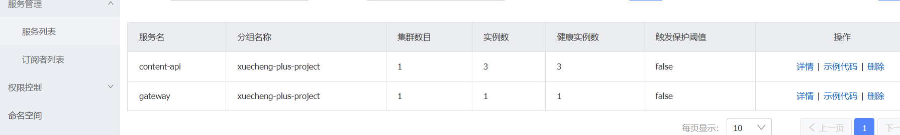
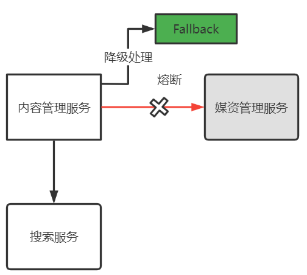
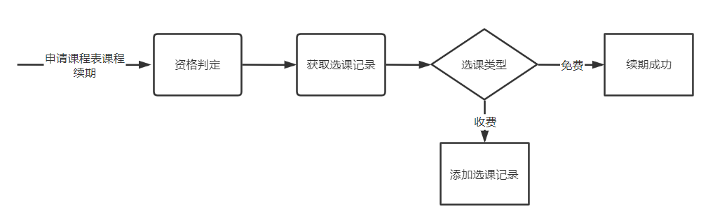

# **第7章 项目总结**

## **1 请介绍一下你的项目**

学成在线项目是一个B2B2C的在线教育平台，培训机构入驻平台后可以发布课程供用户在线学习。项目包括门户、个人学习中心、教学机构管理平台、运营平台、社交系统、系统管理6部分。

功能结构图如下：


项目采用前后端分离的技术架构，使用Spring Cloud技术栈构建微服务，数据库采用MySQL，还使用了Redis、RabbitMQ、Elasticsearch等技术。

技术栈如下图：


## **2 项目技术架构相关**

### **2.1 项目采用什么技术架构?**

项目采用前后端分离的技术架构，使用Spring Cloud技术栈构建微服务，数据库采用MySQL，还使用了Nacos、Spring Cloud Gateway、Redis、RabbitMQ、Elasticsearch、XXL-Job等技术。

### **2.2 微服务都用了哪些技术?**

所有微服务基于Spring Boot构建，分为接口层、模型层、业务层。

1）接口层

提供与前端的HTTP接口实现。

Spring MVC、Spring Security Oauth2 、Swagger

2）模型层

提供PO类、DTO类统一管理。

3）业务层

包括业务Service与MyBatis Mapper。

使用MyBatis-Plus框架实现Mapper开发。

业务Service调用Mapper完成数据持久化。

全部bean被Spring进行管理。

基于Spring进行本地数据库事务控制。

使用XXL-JOB完成任务调度。

RabbitTemplate和消息队列通信。

搜索服务基于Elasticsearch构建。

4）配置文件由Nacos统一管理。

5）微服务远程调用使用Feign实现。

6）服务注册中心使用Nacos实现。

7）使用Spring Cloud Gateway实现网关统一路由。

### **2.3 微服务的maven工程结构是什么样?**

项目分模块进行maven工程构建，如下图：


1、项目由一个父工程对依赖版本进行统一管理、对打包规则进行定义。

2、项目由一个基本工程提供一些公用的工具类、架构基础类库。

3、每个模块基本上分为四个工程如下：

xuecheng-plus-content-api：接口工程，为前端提供接口。

xuecheng-plus-content-service: 业务工程，为接口工程提供业务支撑。

xuecheng-plus-content-model: 数据模型工程，存储数据模型类、数据传输类型等。

xuecheng-plus-content：内容管理模块父工程，负责聚合xuecheng-plus-content-api、xuecheng-plus-content-service、xuecheng-plus-content-model。

### **2.4 Nacos有什么用？怎么用？**

Naocs作为本项目的服务注册中心和配置中心。

服务注册中心：也叫服务发现中心，微服务将自己注册到服务注册中心，服务间远程调用通过服务注册中心获取目标服务的地址，从而进行远程调用。

市面上的服务注册中心有：Zookeeper、Eureka、Nacos、Consul，本项目使用Nacos。

配置中心：统一管理微服务的配置文件。

市面上的配置中心有：Spring Cloud config、Apollo、Nacos。本项目使用Nacos。

微服务中怎么用Nacos？

1、作为配置中心

1）首先配置nacos-config依赖

```xml
<dependency>
    <groupId>com.alibaba.cloud</groupId>
    <artifactId>spring-cloud-starter-alibaba-nacos-config</artifactId>
</dependency>
```
2）在nacos添加配置文件

添加配置文件注意四部分：namespace、group、dataid及文件扩展名。

namespace：命名空间，项目的运行环境。

group: 项目名

Dataid:  包括三部分：服务名、环境名、扩展名，

Dataid举例：content-service-dev.yaml配置文件  由（content-service）-（dev）. (yaml)三部分组成

content-service：第一部分，它是在application.yaml中配置的应用名，即spring.application.name的值。

dev：第二部分，它是环境名，通过spring.profiles.active指定，

Yaml: 第三部分，它是配置文件 的后缀，目前nacos支持properties、yaml等格式类型，本项目选择yaml格式类型。

示例图如下：


3）在项目工程配置boostrap.yml

在boostrap.yml中配置nacos的地址，启动工程将会请求nacos读取配置信息，下边是个例子

```yaml
spring:
  application:
    name: content-api
  cloud:
    nacos:
      server-addr: 192.168.101.65:8848
      discovery:
        namespace: dev1010
        group: xuecheng-plus-project
      config:
        namespace: dev1010
        group: xuecheng-plus-project
        file-extension: yaml
        refresh-enabled: true
```

2、作用服务发现中心

1）首先配置nacos-discovery依赖

```xml
<dependency>
    <groupId>com.alibaba.cloud</groupId>
    <artifactId>spring-cloud-starter-alibaba-nacos-discovery</artifactId>
</dependency>
```
2）启动微服务，自动上传到nacos



### **2.5 Gateway怎么用的？**

本项目使用Spring Cloud Gateway作用网关，网关的作用是负载均衡、路由转发，见下图：


前端请求到Nginx，通过负载均衡到Gateway网关，通过网关将请求转发至各个微服务。

网关进行路由时需要知道每个微服务实例的地址，网关从nacos读取服务地址，如下图：


流程如下：

1、微服务启动，将自己注册到Nacos，Nacos记录了各微服务实例的地址。

2、网关从Nacos读取服务列表，包括服务名称、服务地址等。

3、请求到达网关，网关将请求路由到具体的微服务。

本项目网关还具有统一鉴权功能：

1、网站白名单

在白名单的中的地址不进行身份校验直接放行。

2、身份校验

校验请求中jwt令牌的合法性，令牌合法则继续访问，否则拒绝访问。

### **2.6 Redis怎么用的？**

redis缓存的是白名单接口（无需认证即可访问）所需要的数据，缓存了普通用户所要查询的数据（我的订单、我的选课），缓存热点数据（最新发布的课程信息、推荐课程信息等）。

每类信息有不同的缓存过期时间，为了避免缓存雪崩缓存时间加了随机数。

验证码 

30秒 字符串

课程发布信息 

7天 hash

课程视频信息

7天 hash

我的课程

3分钟 hash

我的订单

3分钟 hash

项目使用Redisson实现分布式锁，避免课程查询等公开接口出现缓存击穿问题。

### **2.7 RabbitMQ怎么用的？**

消息队列在本项目用于订单服务，支付成功通过消息队列将结果通知给其它微服务。

具体使用方法见下图：


订单服务将支付结果发通过给fanout类型的交换机，由交换机将消息广播发送至每个接收支付结果的微服务。

订单服务监听支付结果回复队列，微服务收到支付结果并处理完成将回复结果发给支付结果回复队列，订单服务收到结果不再发送支付结果通知。

### **2.8 Elasticsearch怎么用的？**

本项目使用Elasticsearch对课程发布信息进行索引和搜索。

1、首先创建课程信息的索引

```json
PUT /course-publish
{
  "settings": {
    "number_of_shards": 1,
    "number_of_replicas": 0
  },
  "mappings": {
    "properties": {
      "id": {
        "type": "keyword"
      },
      "companyId": {
        "type": "keyword"
      },
      "companyName": {
        "analyzer": "ik_max_word",
        "search_analyzer": "ik_smart",
        "type": "text"
      },
      "name": {
        "analyzer": "ik_max_word",
        "search_analyzer": "ik_smart",
        "type": "text"
      },
      "users": {
        "index": false,
        "type": "text"
      },
      "tags": {
        "analyzer": "ik_max_word",
        "search_analyzer": "ik_smart",
        "type": "text"
      },
      "mt": {
        "type": "keyword"
      },
      "mtName": {
        "type": "keyword"
      },
      "st": {
        "type": "keyword"
      },
      "stName": {
        "type": "keyword"
      },
      "grade": {
        "type": "keyword"
      },
      "teachmode": {
        "type": "keyword"
      },
      "pic": {
        "index": false,
        "type": "text"
      },
      "description": {
        "analyzer": "ik_max_word",
        "search_analyzer": "ik_smart",
        "type": "text"
      },
      "createDate": {
        "format": "yyyy-MM-dd HH:mm:ss",
        "type": "date"
      },
      "status": {
        "type": "keyword"
      },
      "remark": {
        "index": false,
        "type": "text"
      },
      "charge": {
        "type": "keyword"
      },
      "price": {
        "type": "scaled_float",
        "scaling_factor": 100
      },
      "originalPrice": {
        "type": "scaled_float",
        "scaling_factor": 100
      },
      "validDays": {
        "type": "integer"
      }
    }
  }
}
```
2、定义索引、搜索接口。

3、课程信息索引。

课程发布由内容管理服务远程调用搜索服务添加索引接口将课程信息添加至ES索引库。

课程下架由内容管理服务远程调用搜索服务删除索引接口将课程信息从ES索引库删除。

4、课程搜索接口使用了布尔查询、聚合搜索、过滤器、高亮显示等功能。

### **2.9 XXL-Job怎么用的？**

首先说XXL-JOB的工作流程，然后说本项目使用XXL-JOB具体方案。

1 XXL-JOB的工作流程

XXL-JOB分布式任务调度服务由调用中心和执行器组成，调用中心负责按任务调度策略向执行器下发任务，执行器负责接收任务执行任务。如下图：


1）在微服务配置执行器名称、端口，启动微服务后执行器向调用中心注册。

可通过调度中心页面查询执行器是否注册成功


2）在微服务定义任务方法

下边是课程发布任务的示例


3）在调用中心配置任务调度策略


4）启动任务进行任务调度。

2、本项目使用XXL-JOB的具体方案

本项目使用XXL-JOB完成课程发布数据同步、支付结果通知等任务。

下边以视频处理任务为例说明：

1\) 调度中心采用分片广播方式下发任务

执行器部署在多个微服务实例，收到任务从数据库读取待处理任务列表：


每个执行器收到广播任务有两个参数：分片总数、分片序号。每个执行器从数据表取任务时可以让任务id 模上 分片总数，如果等于分片序号则执行此任务。

上边两个执行器实例的分片总数为2，序号为0、1，从任务1开始，如下：

1  %  2 = 1    执行器2执行

2  %  2 =  0    执行器1执行

3  %  2 =  1     执行器2执行

2）得到待处理任务启动多任务进行任务处理

下图是视频上传及处理的业务流程：


上传视频成功向视频处理待处理表添加记录

由于调度中心进行任务调度，执行器从数据库查询待处理任务，启动多线程进行处理。

**2.10 如何保证任务不重复执行?**

1、执行器收到作业分片广播，计算 任务id 模上 分片总数的结果，等于分片序号任务去执行，这里保证了不同的执行器执行不同的任务。

2、配置调度过期策略，避免同一个执行器多次重复执行同一个任务

调度过期策略如下：
  - 忽略：调度过期后，忽略过期的任务，从当前时间开始重新计算下次触发时间；
  - 立即执行一次：调度过期后，立即执行一次，并从当前时间开始重新计算下次触发时间；
  - 阻塞处理策略：调度过于密集执行器来不及处理时的处理策略；

这里我们选择忽略，如果立即执行一次可能会重复调度。


其次，再看阻塞处理策略，阻塞处理策略就是当前执行器正在执行任务还没有结束时调度时间到达到，此时该如何处理。

查看文档如下：
  单机串行（默认）：调度请求进入单机执行器后，调度请求进入FIFO队列并以串行方式运行；
  丢弃后续调度：调度请求进入单机执行器后，发现执行器存在运行的调度任务，本次请求将会被丢弃并标记为失败；
  覆盖之前调度：调度请求进入单机执行器后，发现执行器存在运行的调度任务，将会终止运行中的调度任务并清空队列，然后运行本地调度任务；

这里选择 丢弃后续调度，避免重复调度。

3、保证任务处理的幂等性

幂等性是为了解决重复提交问题，比如：恶意刷单，重复支付等。

解决幂等性常用的方案：

1）数据库约束，比如：唯一索引，主键。

2）乐观锁，常用于数据库，更新数据时根据乐观锁状态去更新。

3）唯一序列号，操作传递一个唯一序列号，操作时判断与该序列号相等则执行。

这里我们在数据库视频处理表中添加处理状态字段，视频处理完成更新状态为完成，执行视频处理前判断状态是否完成，如果完成则不再处理。

**2.11 如何定义一个接口？**

1、确定协议

定义一个接口首先确定接口的协议，Http协议及具体的方法（GET、POST、PUT、DELETE）

2、请求

接下来需要分析请求及响应的数据格式与内容。

get 请求时，前端请求key/value串，SpringMVC采用基本数据类型（String、Integer等）或自定义类型接收。

Post请求时，前端请Form表单数据（application/x-www-form-urlencoded）和Json数据(Content-Type=application/json)、多部件类型数据（multipart/form-data），对于Json数据SpringMVC使用@RequestBody注解解析请求的json数据。

3、响应

基本上都是返回Json格式的响应结果。

4、生成接口文档

使用swagger注解描述接口的内容，使用Swagger生成接口文档。

**2.12 如何进行接口开发?**

1、首先要仔细阅读接口文档

搞清楚接口的协议、请求及响应的数据格式、http状态码要求等。

2、使用代码生成器生成Mapper接口、Mapper xml文件和PO类。

3、编写Service接口与Service实现。

4、对自定义的Mapper与Service方法进行单元测试。

5、在Controller调用Service完成业务逻辑处理。

6、使用HttpClient工具测试Controller接口。

**2.13 接口异常如何处理？**

接口在过程中存在异常由统一异常处理器进行处理。

1、处理自定义异常

程序在编写代码时根据校验结果主动抛出自定义异常类XueChengPlusException的对象，并编写详细的异常信息，异常处理器捕获异常信息记录异常日志并响应给用户。

2、处理未知异常

接口执行过程中的一些运行时异常也会由异常处理器统一捕获，记录异常日志，统一响应给用户500错误及统一的异常信息。

异常处理器使用控制器增加注解@ControllerAdvice和异常处理注解@ExceptionHandler来实现。

**2.13 如何进行接口测试和前后端联调？**

每个接口开发完成在本地使用HttpClient工具进行测试。

一个模块的接口开发完成后会和前端进行前后端联调。

什么是前后端联调？

前期接口定义好，前后端的工程师就开始并行开发了，前端开发人员在展示数据时会使用mock数据即假数据或叫虚拟数据进行开发，当前后端代码完成后，通常以模块为单位前后端工程开始进行接口联调，前端工程师将mock数据删除改为请求后端接口获取，前端代码请求后端服务测试接口是否正常，这个过程是前后端联调。

当前后端联调出现问题需要根据测试环境下接口的请求及响应数据内容去判断是否符合接口文档的要求。查出是前端或后端的问题由具体的工程师负责修改，修改后再次回归测试。

**2.14 如何解决接口跨域问题?**

什么是跨域问题？

当浏览器通过Ajax调用服务端接口出现 No 'Access-Control-Allow-Origin' header..的信息时说明浏览器在调用接口时出现了跨域问题。

跨域是基于浏览器的同源策略，去判断是否跨域请求，同源策略是浏览器的一种安全机制，从一个地址请求另一个地址，如果协议、主机、端口三者相同则不是跨域，否则就是跨域请求。

比如下边的跨域例子：

从<http://localhost:8601>  到   <http://localhost:8602>  由于端口不同，是跨域。

从<http://192.168.101.10:8601>  到   <http://192.168.101.11:8601>  由于主机不同，是跨域。

从<http://192.168.101.10:8601>  到   <https://192.168.101.11:8601>  由于协议不同，是跨域。

解决跨域问题的方法如下：

1、JSONP

通过script标签的src属性进行跨域请求，如果服务端要响应内容则首先读取请求参数callback的值，callback是一个回调函数的名称，服务端读取callback的值后将响应内容通过调用callback函数的方式告诉请求方。如下图：


2、添加响应头

服务端定义过滤器，在响应头添加 Access-Control-Allow-Origin：*

3、通过nginx代理跨域

由于服务端之间没有跨域，浏览器通过nginx去访问跨域地址。

下边是一个示例说明：


1）浏览器先访问<http://192.168.101.10:8601> nginx提供的地址，进入页面

2）此页面要跨域访问<http://192.168.101.11:8601> ，不能直接跨域访问<http://www.baidu.com:8601>  ，而是访问nginx的一个同源地址，比如：<http://192.168.101.11:8601/api> ，通过<http://192.168.101.11:8601/api> 的代理去访问<http://www.baidu.com:8601>。

这样就实现了跨域访问。

浏览器到<http://192.168.101.11:8601/api> 没有跨域

nginx到<http://www.baidu.com:8601>通过服务端通信，没有跨域。

**2.14 微服务之间接口如何调用？**

微服务之间使用Feign进行远程调用，每个微服务都将自己注册到了服务注册中心nacos中，微服务在远程调用时会从服务注册中心找到目标服务的地址进行远程调用。

当目标服务异常在远程调用时发生熔断，此时调用方要定义降级方法保证请求快速响应。

项目中使用FeignClient的fallbackFactory 编写降级方法，使用fallbackFactory 的好处可以获取发生熔断的异常信息。

**2.15 什么是熔断降级？**

熔断：

当下游服务异常而断开与上游服务的交互，它就相当于保险丝，下游服务异常触发了熔断，从而保证上游服务不受影响。


降级：

当下游服务异常触发熔断后，上游服务就不再去调用异常的微服务而是执行了降级处理逻辑，这个降级处理逻辑可以是本地一个单独的方法。



两者都是为了保护系统，熔断是当下游服务异常时一种保护系统的手段，降级是熔断后上游服务处理熔断的方法。

项目中使用FeignClient的fallbackFactory 编写降级方法，使用fallbackFactory 的好处可以获取发生熔断的异常信息。

如下代码示例：

定义FeignClient接口时指定fallbackFactory 。

```Java
@FeignClient(value = "media-api",fallbackFactory = MediaServiceClientFallbackFactory.class)
```
定义fallbackFactory ：

```Java

@Slf4j
@Component
public class MediaServiceClientFallbackFactory implements FallbackFactory<MediaServiceClient> {
    @Override
    public MediaServiceClient create(Throwable throwable) {
        return new MediaServiceClient(){
            @Override
            public String uploadFile(MultipartFile upload, String folder, String objectName) {
                log.error("远程调用媒资管理服务熔断异常：{}",throwable);
                return null;
            }
        };
    }
}
```
**2.16 如何解决微服务雪崩?**

什么是雪崩效应？


微服务的雪崩效应表现在服务与服务之间调用，当其中一个服务无法提供服务可能导致其它服务也死掉，比如：服务B调用服务A，由于A服务异常导致B服务响应缓慢，最后B、C等服务都不可用，像这样由一个服务所引起的一连串的多个服务无法提供服务即是微服务的雪崩效应。

如何解决微服务雪崩效应？

发生服务等待的原因可能是Feign的请求超时过长，也可能是Tomcat的线程用完，解决前者只要配置Feign的连接超时时长小一些即可，解决后者则需要线程隔离，给高并发的方法设置自己的专属线程池，这样当高并发到来其它的接口不受高并发方法的影响。

另外在还可以从以下方面去预防微服务雪崩：

1、熔断

当目标服务无法请求可以通过熔断将链路断开。

使用histrix框架实现。

2、降级

当熔断发生走降级方法可以返回预先设置的数据。

使用histrix框架实现。

3、限流

对于高并发请求的接口要进行限流，避免无限制的请求压力全部到达系统。

限流的方法可以用nginx实现，也可以用sentinel等中间件。


## **3 业务流程与技术方案**

### **3.1 内容管理模块**

#### **3.1.1 整体业务流程**

内容管理由教学机构人员和平台的运营人员共同完成。

教学机构人员的业务流程如下：

1、登录教学机构。

2、维护课程信息，添加一门课程需要编辑课程的基本信息、上传课程图片、课程营销信息、课程计划、上传课程视频、课程师资信息等内容。

3、课程信息编辑完成，通过课程预览确认无误后提交课程审核。

4、待运营人员课程审核通过后方可进行课程发布。

运营人员的业务流程如下：

1、查询待审核的课程信息。

2、审核课程信息。

3、提交审核结果。

课程从添加到发布的整体流程如下：


#### **3.1.2 流程控制方案**

如何控制课程审核通过才可以发布课程呢？

在课程基本表course_base表设置课程审核状态字段，包括：未提交、已提交(未审核)、审核通过、审核不通过。

下边是课程状态的转化关系：


说明如下：

1、一门课程新增后它的审核状为”未提交“，发布状态为”未发布“。

2、课程信息编辑完成，教学机构人员执行”提交审核“操作。此时课程的审核状态为”已提交“。

3、当课程状态为已提交时运营平台人员对课程进行审核。

4、运营平台人员审核课程，结果有两个：审核通过、审核不通过。

5、课程审核过后不管状态是通过还是不通过，教学机构可以再次修改课程并提交审核，此时课程状态为”已提交“。此时运营平台人员再次审核课程。

6、课程审核通过，教学机构人员可以发布课程，发布成功后课程的发布状态为”已发布“。

7、课程发布后通过”下架“操作可以更改课程发布状态为”下架“

8、课程下架后通过”上架“操作可以再次发布课程，上架后课程发布状态为“发布”。

#### **3.1.3 课程审核流程**

教学机构提交课程审核后，平台运营人员登录运营平台查询待审核的记录。


具体审核的过程与课程预览的过程类似，运营人员查看课程信息、课程视频等内容。

如果存在问题则审核不通过，并附上审核不通过的原因供教学机构人员查看。

如果课程内容没有违规信息且课程内容全面则审核通过。

课程审核通过后教学机构发布课程成功。

#### **3.1.4 课程发布分布式事务方案**

课程发布操作后，先更新数据库中的课程发布状态，更新后向redis、elasticsearch、MinIO写课程信息，这里存在分布式事务，只要在一定时间内最终向redis、elasticsearch、MinIO写数据成功即可，所以课程发布满足AP即可，保证可用性实现最终数据一致性。

分布式事务控制的方案采用本地消息表加任务调度的方案，下图是具体的技术方案：


1、在内容管理服务的数据库中添加一个消息表，消息表和课程发布表在同一个数据库。

2、点击课程发布通过本地事务向课程发布表写入课程发布信息，同时向消息表写课程发布的消息。两条记录保证同时存在或同时不存在。

3、启动任务调度系统定时调度内容管理服务去定时扫描消息表的记录。

4、当扫描到课程发布的消息时即开始完成向redis、elasticsearch、MinIO同步数据的操作。

5、同步数据的任务完成后删除消息表记录。

下图是课程发布操作的流程：


1、执行发布操作，内容管理服务存储课程发布表的同时向消息表添加一条“课程发布任务”。这里使用本地事务保证课程发布信息保存成功，同时消息表也保存成功。

2、任务调度服务定时调度内容管理服务扫描消息表，由于课程发布操作后向消息表插入一条课程发布任务，此时扫描到一条任务。

3、拿到任务开始执行任务，分别向redis、elasticsearch及文件系统存储数据。

4、任务完成后删除消息表记录。

#### **3.1.5 课程发布任务调度方案**

由xxl-job调度中心根据任务策略通过分片广播的模式下发任务到执行器，执行器扫描本地消息表中的未处理的消息(任务)，通过多线程执行任务，每个任务为一门课程的发布任务，执行完成删除本地消息表的记录。

xxl-job的使用方法及如何保证任务不重复执行请参考 “ 第2节项目技术架构相关” 。

#### **3.1.6 页面静态化方案**

课程信息页面的访问量较大，并且课程信息发布后在一段时间不会修改，这里使用Freemarker静态化技术将课程信息页面静态化，提前生成html页面并通过媒资管理模块的文件服务上传到文件系统，用户浏览课程信息页面通过分布文件系统浏览，提高了课程信息页面访问性能。

#### **3.1.7 课程搜索方案**

本项目使用Elasticsearch对课程发布信息进行索引和搜索。

详细参考“ 第2节项目技术架构相关” 。

### **3.2 媒资管理模块**

#### **3.1.1 断点续传流程**

下图是大文件上传的整体流程：


1、前端上传文件前请求媒资接口层检查文件是否存在，如果已经存在则不再上传。

2、如果文件在系统不存在则前端开始上传，首先对视频文件进行分块

3、前端分块进行上传，上传前首先检查分块是否上传，如已上传则不再上传，如果未上传则开始上传分块。

4、前端请求媒资管理接口层请求上传分块。

5、接口层请求服务层上传分块。

6、服务端将分块信息上传到MinIO。

7、前端将分块上传完毕请求接口层合并分块。

8、接口层请求服务层合并分块。

9、服务层根据文件信息找到MinIO中的分块文件，下载到本地临时目录，将所有分块下载完毕后开始合并 。

10、合并完成将合并后的文件上传到MinIO。

#### **3.1.2 任务调度视频处理流程**

视频上传及处理的业务流程如下：


上传视频成功向视频处理待处理表添加记录。

视频处理的详细流程如下：


1、任务调度中心广播作业分片。

2、执行器收到广播作业分片，从数据库读取待处理任务。

3、执行器根据任务内容从MinIO下载要处理的文件。

4、执行器启动多线程去处理任务。

5、任务处理完成，上传处理后的视频到MinIO。

6、将更新任务处理结果，如果视频处理完成除了更新任务处理结果以外还要将文件的访问地址更新至任务处理表及文件表中，最后将任务完成记录写入历史表。

#### **3.1.3 文件服务访问方案**

在线插放课程视频，课程图片、视频这些都在MinIO文件系统存储，统一由Nginx代理，通过文件服务域名统一访问。如下图：


在nginx配置文件服务的二级域名

```conf
   server {
        listen       80;
        server_name  file.xuecheng-plus.com;
        ....
```

### **3.3 认证授权模块**

#### **3.3.1 认证流程**

下图是本项目的认证流程：


1、提供统一认证入口。

2、前端请求认证，认证通过颁发jwt令牌返给前端

3、前端携带jwt令牌通过网关访问微服务。

4、网关负责校验jwt令牌的合法性，微服务负责进行授权。

#### **3.3.2 网关统一鉴权做什么?**

所有访问微服务的请求都要经过网关，在网关进行用户身份的认证可以将很多非法的请求拦截到微服务以外，这叫做网关鉴权。

下边需要明确网关鉴权的职责：

1、网站白名单维护

针对不用认证的URL全部放行。

2、校验jwt的合法性。

除了白名单剩下的就是需要认证的请求，网关需要验证jwt的合法性，jwt合法则说明用户身份合法，否则说明身份不合法则拒绝继续访问。

3、网关不负责授权，授权在各个微服务进行，因为微服务最清楚用户有哪些权限访问哪些接口。

#### **3.3.3 什么是OAuth2**

OAUTH协议为用户资源的授权提供了一个安全的、开放而又简易的标准，Oauth协议目前发展到2.0版本，1.0版本过于复杂，2.0版本已得到广泛应用，通常一些大平台如微信、支付宝都提供OAuth2协议的认证授权接口。

理解OAuth2协议可以通过一个例子，这里以微信扫码登录黑马网站为例说明：


Oauth2.0认证流程如下：

引自Oauth2.0协议rfc6749 <https://tools.ietf.org/html/rfc6749>


Oauth2包括以下角色：

1、客户端

本身不存储资源，需要通过资源拥有者的授权去请求资源服务器的资源，比如：手机客户端、浏览器等。

上边示例中黑马网站即为客户端，它需要通过浏览器打开。

2、资源拥有者

通常为用户，也可以是应用程序，即该资源的拥有者。

A表示 客户端请求资源拥有者授权。

B表示 资源拥有者授权客户端即黑马网站访问自己的用户信息。

3、授权服务器（也称认证服务器）

认证服务器对资源拥有者进行认证，还会对客户端进行认证并颁发令牌。

C 客户端即黑马网站携带授权码请求认证。

D认证通过颁发令牌。

4、资源服务器

存储资源的服务器。

E表示客户端即黑马网站携带令牌请求资源服务器获取资源。

F表示资源服务器校验令牌通过后提供受保护资源。

#### **3.3.2 微信扫码流程**

根据OAuth2协议授权码流程，结合本项目自身特点，分析接入微信扫码登录的流程如下：


本项目认证服务需要做哪些事？

1、需要定义接口接收微信下发的授权码。

2、收到授权码调用微信接口申请令牌。

3、申请到令牌调用微信获取用户信息

4、获取用户信息成功将其写入本项目用户中心数据库。

5、最后重定向到浏览器自动登录。

#### **3.3.3 授权相关的数据模型**

本项目授权相关的数据表如下：


说明如下：

xc_user：用户表，存储了系统用户信息，用户类型包括：学生、老师、管理员等

xc_role：角色表，存储了系统的角色信息，学生、老师、教学管理员、系统管理员等。

xc_user_role：用户角色表，一个用户可拥有多个角色，一个角色可被多个用户所拥有

xc_menu:模块表，记录了菜单及菜单下的权限

xc_permission:角色权限表，一个角色可拥有多个权限，一个权限可被多个角色所拥有

如何查询用户的权限？

```sql
SELECT * FROM xc_menu WHERE id IN(
    SELECT menu_id FROM xc_permission WHERE role_id IN(
        SELECT role_id FROM xc_user_role WHERE user_id = '49'
    )
)
```
#### **3.3.4 验证码校验流程**

验证码服务对外提供的接口有：

1、生成验证码

2、校验验证码。

验证码服务如何生成并校验验证码？

拿图片验证码举例：

1、先生成一个指定位数的验证码，根据需要可能是数字、数字字母组合或文字。

2、根据生成的验证码生成一个图片并返回给页面

3、给生成的验证码分配一个key，将key和验证码一同存入缓存。这个key和图片一同返回给页面。

4、用户输入验证码，连同key一同提交至认证服务。

5、认证服务拿key和输入的验证码请求验证码服务去校验

6、验证码服务根据key从缓存取出正确的验证码和用户输入的验证码进行比对，如果相同则校验通过，否则不通过。


#### **3.3.5 什么是JWT令牌**

JSON Web Token（JWT）是一种使用JSON格式传递数据的网络令牌技术，它是一个开放的行业标准（RFC 7519），用于在通信双方传递json对象，传递的信息经过数字签名可以被验证和信任，它可以使用HMAC算法或使用RSA的公钥/私钥对来签名，防止内容篡改。

JWT令牌的优点：

1、jwt基于json，非常方便解析。

2、可以在令牌中自定义丰富的内容，易扩展。

3、通过非对称加密算法及数字签名技术，JWT防止篡改，安全性高。

4、资源服务使用JWT可不依赖认证服务即可完成授权。

缺点：

１、JWT令牌较长，占存储空间比较大。

JWT令牌由三部分组成，每部分中间使用点（.）分隔，比如：xxxxx.yyyyy.zzzzz

1. Header        

  头部包括令牌的类型（即JWT）及使用的哈希算法（如HMAC SHA256或RSA）

1.   Payload

  第二部分是负载，内容也是一个json对象，它是存放有效信息的地方，它可以存放jwt提供的现成字段，比如：iss（签发者）,exp（过期时间戳）, sub（面向的用户）等，也可自定义字段。

1.   Signature

  第三部分是签名，此部分用于防止jwt内容被篡改。

  这个部分使用base64url将前两部分进行编码，编码后使用点（.）连接组成字符串，最后使用header中声明签名算法进行签名。

#### **3.3.6 JWT令牌可以防止篡改吗？**

JWT可以防止篡改。

第三部分使用签名算法对第一部分和第二部分的内容进行签名，常用的签名算法是 HS256，常见的还有md5,sha 等，签名算法需要使用密钥进行签名，密钥不对外公开，并且签名是不可逆的，如果第三方更改了内容那么服务器验证签名就会失败，要想保证验证签名正确必须保证内容、密钥与签名前一致。


从上图可以看出认证服务和资源服务使用相同的密钥，这叫对称加密，对称加密效率高，如果一旦密钥泄露可以伪造jwt令牌。

JWT还可以使用非对称加密，认证服务自己保留私钥，将公钥下发给受信任的客户端、资源服务，公钥和私钥是配对的，成对的公钥和私钥才可以正常加密和解密，非对称加密效率低但相比对称加密非对称加密更安全一些。

#### **3.3.7 Spring Security的工作原理是什么?**

Spring Security所解决的问题就是**安全访问控制**，初始化Spring Security时，会创建一个名为SpringSecurityFilterChain的Servlet过滤器， 它是一个过滤器链，账号密码登录方式使用UsernamePasswordAuthenticationFilter过滤器。

Spring Security的执行流程如下：


1. 用户提交用户名、密码被SecurityFilterChain中的UsernamePasswordAuthenticationFilter过滤器获取到，封装为请求Authentication，通常情况下是UsernamePasswordAuthenticationToken这个实现类。
2. 然后过滤器将Authentication提交至认证管理器（AuthenticationManager）进行认证
3. 认证成功后，AuthenticationManager身份管理器返回一个被填充满了信息的（包括上面提到的权限信息，身份信息，细节信息，但密码通常会被移除）Authentication实例。
4. SecurityContextHolder安全上下文容器将第3步填充了信息的Authentication，通过SecurityContextHolder.getContext().setAuthentication(…)方法，设置到其中。
5.   可以看出AuthenticationManager接口（认证管理器）是认证相关的核心接口，也是发起认证的出发点，它的实现类为ProviderManager。而Spring Security支持多种认证方式，因此ProviderManager维护着一个List<AuthenticationProvider>列表，存放多种认证方式，最终实际的认证工作是由AuthenticationProvider完成的。咱们知道web表单的对应的AuthenticationProvider实现类为DaoAuthenticationProvider，它的内部又维护着一个UserDetailsService负责UserDetails的获取。最终AuthenticationProvider将UserDetails填充至Authentication。

### **3.4 选课学习**

#### **3.4.1 选课流程**

选课是将课程加入我的课程表的过程。

对免费课程选课后可直接加入我的课程表，对收费课程选课后需要下单支付成功系统自动加入我的课程表。

流程如下：


#### **3.4.2 在线学习流程**

课成功用户使可以在线学习，对于免费课程无需选课即可在线学习。

流程如下：


#### **3.4.3 免费课程续期流程**

免费课程加入我的课程表默认为1年有效期，到期用户可申请续期，流程如下：



### **3.5 订单支付**

#### **3.5.1 支付流程**

当用户点击“微信支付”或支付宝支付时执行流程如下：


1、请求学习中心服务创建选课记录

2、请求订单服务创建商品订单、生成支付二维码。

3、用户扫码请求订单支付服务，订单支付服务请求第三方支付平台生成支付订单。

4、前端唤起支付客户端，用户输入密码完成支付。

5、第三方支付平台支付完成发起支付通知。

6、订单支付服务接收支付通知结果。

7、用户在前端查询支付结果，请求订单支付服务查询支付结果，如果订单支付服务还没有收到支付结果则请求学习中心查询支付结果。

8、订单支付服务向学习中心服务通知支付结果。

9、学习中心服务收到支付结果，如果支付成功则更新选课记录，并添加到我的课程表。

#### **3.5.2 生成二维码执行流程**

生成二维码执行流程如下：


执行流程：

1、前端调用学习中心服务的添加选课接口。

2、添加选课成功请求订单服务生成支付二维码接口。

3、生成二维码接口：创建商品订单、生成支付交易记录、生成二维码。

4、将二维码返回到前端，用户扫码。

#### **3.5.3 用户扫码支付流程**

用户扫码支付流程如下：


#### **3.5.4 支付结果通知流程**

订单服务作为通用服务在订单支付成功后需要将支付结果通知给与订单服务对接的其它微服务。

为了保证通知过程的简便还要保证消息全部到达消费服务，采用发布订阅的方式通知支付结果。


学习中心服务：对收费课程选课需要支付，与订单服务对接完成支付。

学习资源服务：对收费的学习资料需要购买后下载，与订单服务对接完成支付。

订单服务完成支付后将支付结果发给每一个与订单服务对接的微服务，订单服务将消息发给交换机，由交换机广播消息，每个订阅消息的微服务都可以接收到支付结果，根据支付结果的内容去更新自己的业务数据。

学习中心等微服务收到消息并处理完成通过消息队列回复订单服务。

#### **3.5.5 支付结果通知分布式事务方案**

订单服务先将支付结果更新成功后再将支付结果通知给其它微服务，只要保证最终将支付结果通知到微服务保证最终一致性即可，可以采用课程发布模块的技术方案，先通过本地事务更新支付结果的同时添加一条消息表记录，再由任务调度去定时调度将支付结果通知给其它微服务。


## **4 研发流程相关**

### **4.1 项目的标准过程**

启动阶段
项目的可行性分析、立项、招投标、合同签署。
计划阶段
范围定义、进度安排、资源计划、成本估计、质量保证计划、风险计划、实施计划等。
实施及控制阶段
项目实施、进度控制、费用控制、质量控制、变更控制等。
结束阶段
范围确认、质量验收、费用结算与审计、项目资料验收、项目交接与清算、项目审计与评估、项目总结等。

### **4.2 缺陷修复流程**

开发结束由测试人员对软件进行测试，通常使用项目管理软件管理缺陷，流程如下：


### **4.3 运维流程**


### **4.4 持续集成**

#### **4.4.1 什么是持续集成？devops**

传统的软件开发流程如下：

1、项目经理分配模块给开发人员

2、每个模块的开发人员并行开发，并进行单元测试

3、开发完毕，将代码集成部署到测试服务器，测试人员进行测试。

4、测试人员发现bug，提交bug、开发人员修改bug

5、bug修改完毕再次集成、测试。

问题描述：

1、模块之间依赖关系复杂，在集成时发现大量bug

2、测试人员等待测试时间过长

3、软件交付无法保障

解决上述问题的思考：

1、能否把集成测试时间提前？

2、能否使用自动化工具代替人工集成部署的过程？

查阅百度百科

持续集成是一种软件开发实践，即团队开发成员经常集成他们的工作，通常每个成员每天至少集成一次，也就意味着每天可能会发生多次集成。每次集成都通过自动化的构建（包括[编译](https://baike.baidu.com/item/%E7%BC%96%E8%AF%91/1258343?fromModule=lemma_inlink)，发布，自动化测试）来验证，从而尽早地发现集成错误。

持续集成的好处：

1、自动化集成部署，提高了集成效率。

2、更快的修复问题。

3、更快的进行交付。

4、提高了产品质量。

#### **4.4.2 如何做持续集成**

下图说明了持续集成的流程：


  软件序列图：


持续集成的工具有很多，上图中使用的Jenkins是一个优秀的持续集成工具，请自行查阅资料学习。

Jenkins是一个领先的开源自动化服务器，可用于自动化构建，测试，部署软件等相关任务。

官网地址：<https://jenkins.io>


